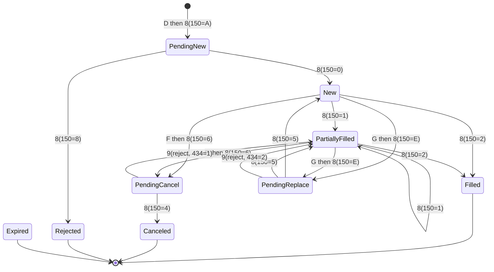

# FIX 4.2 Domain Model & Message Linking

> **Design draft.** This document is part of the design exploration. For the authoritative, reconciled decisions and the corrections applied after review, see [00-overview.md](00-overview.md).


This document is the domain reference for **fix42-oms-cache**: a Java library that
consumes FIX 4.2 audit-trail / drop-copy streams and maintains an in-memory cache of
the latest state of every order (parent and child) plus the full joined message
history per order.

It explains the FIX 4.2 wire format, the seven in-scope message types, the identifier
system that stitches messages into a single order "chain", a fully worked lifecycle
example, and the edge cases the cache must survive. Everything here maps directly onto
the canonical names in the project anchor (`OrderState`, the `OmsCache` API, and the
seven cache indexes).

> **Scope note:** This is FIX **4.2** (protocol version string `FIX.4.2`, tag `8=FIX.4.2`).
> Where a tag or concept only exists in a later version (4.4 / 5.0 / FIXT), it is
> explicitly labeled. We do **not** attribute later-version tags to 4.2.

---

## 1. FIX wire format

### 1.1 Tag=Value, SOH-delimited

A FIX message is a flat, ordered sequence of `tag=value` pairs. Each pair is terminated
by the **SOH** control character (ASCII `0x01`, Unicode `U+0001`). Conventionally SOH is
rendered as `|` or `^A` in documentation; on the wire it is a single non-printable byte.

```
8=FIX.4.2 | 9=145 | 35=D | 49=CLIENT | 56=BROKER | 34=2 | 52=20260813-13:45:07.123 |
11=ORD1001 | 55=IBM | 54=1 | 38=1000 | 40=2 | 44=185.50 | 59=0 | 60=20260813-13:45:07 |
10=072 |
```

- Tags are unsigned integers. Values are ASCII strings; the value may contain any byte
  **except** SOH (SOH is the field delimiter). One tag `212 XmlDataLen`/`213 XmlData`
  binary-length pattern exists for embedded binary but is out of scope here.
- Field **order matters** for the standard header, `35 MsgType`, and the trailer; body
  field order is mostly free **except inside repeating groups**, where order is
  significant (see §1.5).
- Our generic proto model (`fix.proto`) is deliberately **lossless and order-preserving**:
  `FixMessage { repeated FixField fields = 1; }` with `FixField { uint32 tag; string value; }`.
  The parser never reorders or dedups fields; typed mappers interpret them.

### 1.2 Standard header (message-type agnostic)

Every admin and application message begins with the standard header. The first three
fields are positional and **must** appear in this exact order:

| Tag | Name         | Req | Notes |
|-----|--------------|-----|-------|
| 8   | BeginString  | Y   | Always first. `FIX.4.2`. |
| 9   | BodyLength   | Y   | Always second. Byte count (see §1.3). |
| 35  | MsgType      | Y   | Always third. `D`, `8`, `9`, `F`, `G`, `H`, `Q`, ... |
| 49  | SenderCompID | Y   | Originator of the message. |
| 56  | TargetCompID | Y   | Intended recipient. |
| 34  | MsgSeqNum    | Y   | Session sequence number. |
| 52  | SendingTime  | Y   | `YYYYMMDD-HH:MM:SS[.sss]` UTC. |
| 43  | PossDupFlag  | N   | `Y` if a possible resend (dedupe hint). |
| 97  | PossResend   | N   | `Y` if application-level resend. |
| 115 | OnBehalfOfCompID | N | Third-party routing. |
| 128 | DeliverToCompID  | N | Third-party routing. |

### 1.3 BodyLength (tag 9)

`BodyLength` is the number of bytes in the message **after** the SOH that terminates
tag 9, up to and **including** the SOH that terminates the field immediately before the
`CheckSum` (tag 10). In other words: everything from the start of `35=...` through the
SOH just before `10=`.

```
count( bytes from first char of "35=..."  up to and including the SOH before "10=" )
```

BeginString (8), BodyLength (9) itself, and CheckSum (10) are **excluded** from the count.

### 1.4 CheckSum (tag 10)

`CheckSum` is always the **last** field. Compute it over **all** bytes of the message
up to and including the SOH that terminates the field before tag 10 (i.e. everything
except the `10=NNN<SOH>` field itself):

```
checksum = ( sum of every byte value ) modulo 256
```

It is rendered as a **zero-padded 3-digit** decimal string, e.g. `10=072`. The value
`72` becomes `072`. This is a transport integrity check only — the cache treats a bad
checksum as a parse/transport concern, not an order-state concern.

> The codec (`:fix-codec` `FixSerializer`) recomputes both `9` and `10` on serialize;
> `FixParser` may validate them on parse but the cache logic never depends on them being
> present in an audit-trail feed (feeds sometimes strip session-level framing).

### 1.5 Repeating groups

A repeating group is introduced by a **NoXXX** count field (an integer), followed by
that many repetitions of an ordered set of member fields. The **first field** of each
repetition is the group's *delimiter* tag, which marks the boundary between entries.

```
382=2 | 375=BRKA | 337=T1 | 375=BRKB | 337=T2 |
  \_ NoContraBrokers=2
        \_ entry 1: ContraBroker=BRKA, ContraTrader=T1
                              \_ entry 2: ContraBroker=BRKB, ContraTrader=T2
```

Because group order and the delimiter tag are semantic, the generic `FixMessage` model
preserves field order exactly; the dictionary-driven typed mappers (`:fix-codec`) know
each group's count tag, delimiter tag, and member tags to project into the typed
`messages.proto` sub-messages.

---

## 2. The seven in-scope message types

All seven are **application** messages. The table below is the master tag reference;
per-message detail and repeating groups follow.

### 2.1 Common order/exec tags (shared vocabulary)

| Tag | Name          | Type     | Meaning in this cache |
|-----|---------------|----------|-----------------------|
| 11  | ClOrdID       | String   | Client order id; **new value per D/F/G**. Maps `OrderState.cl_ord_id`. |
| 41  | OrigClOrdID   | String   | Prior ClOrdID being cancelled/replaced. Maps `OrderState.orig_cl_ord_id`. |
| 37  | OrderID       | String   | Sell-side order id; stable across the chain. Maps `OrderState.order_id`. |
| 17  | ExecID        | String   | Unique per ExecutionReport. Appended to `OrderState.exec_ids`. |
| 19  | ExecRefID     | String   | Refers to a prior ExecID (trade cancel/correct). |
| 20  | ExecTransType | char     | `0`=New `1`=Cancel `2`=Correct `3`=Status. |
| 150 | ExecType      | char     | Why this report was sent (see §2.3). Maps `last_exec_type`. |
| 39  | OrdStatus     | char     | Current order status. Maps `ord_status`. |
| 1   | Account       | String   | Maps `account`; feeds `accountIndex`. |
| 55  | Symbol        | String   | Maps `symbol`; feeds `symbolIndex`. |
| 54  | Side          | char     | `1`=Buy `2`=Sell `5`=SellShort ... Maps `side`. |
| 38  | OrderQty      | Qty      | Ordered quantity. Maps `order_qty`. |
| 40  | OrdType       | char     | `1`=Market `2`=Limit `3`=Stop `4`=StopLimit. Maps `ord_type`. |
| 44  | Price         | Price    | Limit price. Maps `price`. |
| 99  | StopPx        | Price    | Stop trigger price. Maps `stop_px`. |
| 59  | TimeInForce   | char     | `0`=Day `1`=GTC `3`=IOC `4`=FOK `6`=GTD. Maps `time_in_force`. |
| 15  | Currency      | String   | Maps `currency`. |
| 14  | CumQty        | Qty      | Cumulative filled qty. Maps `cum_qty`. |
| 151 | LeavesQty     | Qty      | Open qty remaining. Maps `leaves_qty`. |
| 6   | AvgPx         | Price    | Average fill price. Maps `avg_px`. |
| 32  | LastShares    | Qty      | Qty of this fill. Maps `last_qty`. |
| 31  | LastPx        | Price    | Price of this fill. Maps `last_px`. |
| 30  | LastMkt       | Exchange | Market of execution. Maps `last_market`. |
| 58  | Text          | String   | Free text. Maps `text`. |
| 60  | TransactTime  | UTCTimestamp | Business event time. |
| 526 | SecondaryClOrdID | String | **Default parent-link tag** (see §6). |

> **4.2 vs later note:** In FIX 4.2 the fill quantity tag is **`32 LastShares`** and the
> ordered-quantity tag is `38 OrderQty`. FIX 4.4 renamed `32` to `LastQty`. The proto
> field is called `last_qty` for readability, but the FIX 4.2 tag it reads is **32
> LastShares**. Similarly `30 LastMkt`/`100 ExDestination` are the 4.2 market tags.

### 2.2 `35=D` — NewOrderSingle

**Purpose:** originate a single new order. This is the birth of a chain.

| Tag | Name        | Req in 4.2 | Notes |
|-----|-------------|-----------|-------|
| 11  | ClOrdID     | Y | New, unique. Becomes the chain's first key. |
| 21  | HandlInst   | Y | `1`=auto-private `2`=auto-public `3`=manual. |
| 55  | Symbol      | Y | Instrument. |
| 54  | Side        | Y | Buy/Sell/... |
| 60  | TransactTime| Y | Order creation time. |
| 38  | OrderQty    | Y* | Ordered qty (see cash-order exceptions 152/516). |
| 40  | OrdType     | Y | Market/Limit/Stop/... |
| 44  | Price       | C | Required when `40=2` (Limit) or `40=4`. |
| 99  | StopPx      | C | Required when `40=3` (Stop) or `40=4`. |
| 1   | Account     | N | Common. |
| 15  | Currency    | N | Common. |
| 59  | TimeInForce | N | Defaults to Day if absent. |
| 526 | SecondaryClOrdID | N | Default parent link tag. |

**Repeating groups in 4.2 NewOrderSingle:**

| Count tag | Delimiter | Members | Notes |
|-----------|-----------|---------|-------|
| 78 NoAllocs | 79 AllocAccount | 79 AllocAccount, 80 AllocShares | Pre-trade allocation instructions. |
| 386 NoTradingSessions | 336 TradingSessionID | 336 TradingSessionID | Present in 4.2. |

> **4.2 vs later note:** NewOrderSingle in FIX 4.2 does **not** carry a `NoPartyIDs (453)`
> parties block — that arrived in 4.4. Broker/exchange identity in 4.2 uses `109 ClientID`,
> `76 ExecBroker`, etc. There is also no standard parent-order tag (see §6).

### 2.3 `35=8` — ExecutionReport

**Purpose:** the sell-side's response to everything — acks, rejects, state changes,
fills, cancel confirms, replace confirms. It is the workhorse that drives `OrderState`.

Two orthogonal fields carry the meaning:

**ExecType (150)** — *why this report exists* (the event):

| Code | ExecType | Meaning |
|------|----------|---------|
| 0 | New            | Order accepted (ack). |
| 1 | PartialFill    | A partial fill occurred. |
| 2 | Fill           | A fill that completes the order. |
| 3 | DoneForDay     | Done for day. |
| 4 | Canceled       | Cancel confirmed. |
| 5 | Replace        | Replace confirmed. |
| 6 | PendingCancel  | Cancel request received, pending. |
| 7 | Stopped        | Order stopped. |
| 8 | Rejected       | Order rejected. |
| 9 | Suspended      | Order suspended. |
| A | PendingNew     | New order received, pending ack. |
| B | Calculated     | Calculated (e.g. for allocations). |
| C | Expired        | Order expired (TIF). |
| D | Restated       | Unsolicited restatement (see §5). |
| E | PendingReplace | Replace request received, pending. |

**OrdStatus (39)** — *the resulting state of the order*:

| Code | OrdStatus | Meaning |
|------|-----------|---------|
| 0 | New | Accepted, no fills. |
| 1 | PartiallyFilled | Some qty filled, still open. |
| 2 | Filled | Fully filled (terminal). |
| 3 | DoneForDay | (terminal for the day) |
| 4 | Canceled | (terminal) |
| 5 | Replaced | Superseded by a replace. |
| 6 | PendingCancel | Cancel in flight. |
| 7 | Stopped | |
| 8 | Rejected | (terminal) |
| 9 | Suspended | |
| A | PendingNew | Ack pending. |
| C | Expired | (terminal) |
| E | PendingReplace | Replace in flight. |

> **4.2 note:** In FIX 4.2 the ExecutionReport **also** carries `20 ExecTransType`
> (`0`=New `1`=Cancel `2`=Correct `3`=Status) and `19 ExecRefID`. These handle
> trade-level cancel/correct. FIX 4.4 **deprecated** `20`/`19`/`150 code combinations`
> in favor of `ExecType=Trade(F)` + `TradeReportID`; that model is **out of scope**.

**Key tags on every 8:** `37 OrderID`, `17 ExecID`, `20 ExecTransType`, `150 ExecType`,
`39 OrdStatus`, `11 ClOrdID` (echoed), `41 OrigClOrdID` (on cancel/replace confirms),
`14 CumQty`, `151 LeavesQty`, `6 AvgPx`, and on fills `32 LastShares`, `31 LastPx`,
`30 LastMkt`.

**Repeating groups in 4.2 ExecutionReport:**

| Count tag | Delimiter | Members | Notes |
|-----------|-----------|---------|-------|
| 382 NoContraBrokers | 375 ContraBroker | 375 ContraBroker, 337 ContraTrader, 437 ContraTradeQty, 438 ContraTradeTime | The counterparties of a fill. |

> **Important 4.2 fact:** FIX 4.2 ExecutionReport has **no fills repeating group**.
> There is no `NoFills(1362)`/`FillExecID(1363)` — that is FIX 5.0SP2. In 4.2 each fill
> is delivered as its **own** ExecutionReport (`150=1` or `150=2`) carrying `32 LastShares`
> / `31 LastPx`. The cache accumulates fills by processing successive reports, not by
> reading a group.

### 2.4 `35=9` — OrderCancelReject

**Purpose:** reject a prior `F` (cancel) or `G` (replace) request. It tells the cache the
pending transition failed and the order reverts to its previous state.

| Tag | Name              | Req | Notes |
|-----|-------------------|-----|-------|
| 37  | OrderID           | Y | Order being referenced (may be `NONE` if never acked). |
| 11  | ClOrdID           | Y | ClOrdID of the **rejected** F/G request. |
| 41  | OrigClOrdID       | Y | The ClOrdID the F/G was trying to act on. |
| 39  | OrdStatus         | Y | The order's status **after** the reject (i.e. reverted). |
| 434 | CxlRejResponseTo  | Y | `1`=response to Cancel(F), `2`=response to Replace(G). |
| 102 | CxlRejReason      | N | Reason code. Maps `OrderState.cxl_rej_reason`. |
| 58  | Text              | N | Human-readable reason. |

**No repeating groups.** `CxlRejResponseTo (434)` is critical: it disambiguates whether
the pending cancel or the pending replace is the thing that failed, so the cache knows
which pending transition to unwind.

### 2.5 `35=F` — OrderCancelRequest

**Purpose:** request cancellation of a live order. It does **not** itself change state;
it solicits an `8` (`150=6 PendingCancel` then `150=4 Canceled`) or a `9` (reject).

| Tag | Name         | Req | Notes |
|-----|--------------|-----|-------|
| 41  | OrigClOrdID  | Y | ClOrdID of the order to cancel (**chain link**). |
| 11  | ClOrdID      | Y | **New** ClOrdID identifying this cancel request. |
| 55  | Symbol       | Y | Must match the order. |
| 54  | Side         | Y | Must match the order. |
| 60  | TransactTime | Y | |
| 37  | OrderID      | N | Sell-side id if known (helps linking). |
| 38  | OrderQty     | N | Original order qty (4.2 includes it). |
| 1   | Account      | N | |

**No repeating groups.** Note: `F` carries a **new** ClOrdID(11) *and* the `OrigClOrdID(41)`
that points at the order being cancelled. The new ClOrdID is what a subsequent `9`/`8`
will echo in tag 11.

### 2.6 `35=G` — OrderCancelReplaceRequest

**Purpose:** amend a live order (price, qty, TIF, etc.) — a.k.a. "cancel/replace" or
"order modification". Like `F`, it solicits `8`/`9`; it carries the **new** parameters.

| Tag | Name         | Req | Notes |
|-----|--------------|-----|-------|
| 41  | OrigClOrdID  | Y | ClOrdID being replaced (**chain link**). |
| 11  | ClOrdID      | Y | **New** ClOrdID for the amended order. |
| 21  | HandlInst    | Y | |
| 55  | Symbol       | Y | |
| 54  | Side         | Y | Side cannot change. |
| 60  | TransactTime | Y | |
| 38  | OrderQty     | C | New qty (or restated). |
| 40  | OrdType      | Y | |
| 44  | Price        | C | New price if limit. |
| 99  | StopPx       | C | New stop if stop. |
| 59  | TimeInForce  | N | |

**Repeating groups in 4.2 OrderCancelReplaceRequest:**

| Count tag | Delimiter | Members | Notes |
|-----------|-----------|---------|-------|
| 78 NoAllocs | 79 AllocAccount | 79 AllocAccount, 80 AllocShares | Same as NewOrderSingle. |
| 386 NoTradingSessions | 336 TradingSessionID | 336 TradingSessionID | |

The confirming `8` (`150=5 Replace`, `39=5 Replaced` on the old then `39` reflecting the
new state) echoes the new `11 ClOrdID` and the `41 OrigClOrdID`, and **the new ClOrdID
becomes current** (§4).

### 2.7 `35=H` — OrderStatusRequest

**Purpose:** ask the sell-side to re-send the current status of an order. It is a **read**
— it mutates nothing. The response is an `8` with `20=3 ExecTransType=Status` (and often
`150=` reflecting current ExecType) restating current `39/14/151/6`.

| Tag | Name        | Req | Notes |
|-----|-------------|-----|-------|
| 11  | ClOrdID     | Y | ClOrdID of the order being queried. |
| 55  | Symbol      | Y | |
| 54  | Side        | Y | |
| 37  | OrderID     | N | If known. |
| 1   | Account     | N | |

**No repeating groups.** In the cache, an `H` is recorded in `message_history` and updates
`last_msg_type`/`last_update_epoch_millis`, but it does **not** change order economics.

### 2.8 `35=Q` — DontKnowTrade (DK)

**Purpose:** the recipient of an ExecutionReport (typically a fill) asserts it does **not
recognize** the referenced trade — a "Don't Know". It references a prior execution.

| Tag | Name        | Req | Notes |
|-----|-------------|-----|-------|
| 37  | OrderID     | Y | Order the unknown exec claimed. |
| 17  | ExecID      | Y | The ExecID being DK'd. |
| 127 | DKReason    | Y | `A`=unknown symbol `B`=wrong side `C`=qty exceeds `D`=no matching order `E`=price exceeds `F`=calc diff `Z`=other. |
| 55  | Symbol      | Y | |
| 54  | Side        | Y | |
| 32  | LastShares  | N | Qty of the disputed exec. |
| 31  | LastPx      | N | Price of the disputed exec. |

**No repeating groups.** A DK does not change the order's economics in this cache; it is
recorded in `message_history` (dispute audit) and can be surfaced via `text`. See §5.7.

---

## 3. The identifier system and how messages join

Three identifiers do all the linking work, plus execution-level identifiers for fills.

| Identifier | Assigned by | Lifetime | Role |
|------------|-------------|----------|------|
| **ClOrdID (11)** | order originator (buy-side) | **new value per D / F / G** | The moving "current request" pointer. |
| **OrigClOrdID (41)** | order originator | on F / G / 9 | Points back to the ClOrdID being acted on — the **chain edge**. |
| **OrderID (37)** | sell-side | **stable for the whole chain**; first seen on the first `8` | The permanent order key. |
| **ExecID (17)** | sell-side | unique per `8` | Execution/report identity; dedupe key. |
| **ExecRefID (19)** | sell-side | on cancel/correct `8` | Points at a prior ExecID being cancelled/corrected. |
| **ExecTransType (20)** | sell-side | per `8` | New/Cancel/Correct/Status of the report itself. |

### 3.1 The core problem: OrderID arrives late

A chain is born from a `D` that carries **only** a ClOrdID — the sell-side has not yet
assigned an OrderID. The `OrderID (37)` first appears on the **first ExecutionReport**
(often `150=A PendingNew` or `150=0 New`). So the cache must be able to key an order by
ClOrdID *before* it has an OrderID, then reconcile.

This is exactly why the anchor defines two front-door indexes:

| Index | Key → Value | Purpose |
|-------|-------------|---------|
| `primary` | `orderId → OrderState` | Canonical store once OrderID exists. |
| `pendingByClOrdId` | `clOrdId → OrderState` | Orders **without an OrderID yet**. |
| `clOrdIdIndex` | `clOrdId → orderId` | **Every** ClOrdID in the chain resolves here. |
| `execIdIndex` | `execId → orderId` | Fill/report lookup and dedupe. |
| `accountIndex` | `account → Set<orderId>` | `findByAccount`. |
| `symbolIndex` | `symbol → Set<orderId>` | `findBySymbol`. |
| `parentIndex` | `parentOrderId → Set<childOrderId>` | `getChildren` / `getParent`. |

### 3.2 Chain resolution algorithm (per message)

```
resolve(msg):
  35=D:
     create OrderState keyed by clOrdId
     put into pendingByClOrdId[clOrdId]
     (no orderId yet)

  35=8 (ExecutionReport):
     orderId = msg.37
     if orderId not in primary:
         # first report for this chain — reconcile the pending order
         state = pendingByClOrdId.remove(msg.11)   # echoed ClOrdID
         state.order_id = orderId
         primary[orderId] = state
     else:
         state = primary[orderId]
     clOrdIdIndex[msg.11] = orderId
     if msg has 41: clOrdIdIndex[msg.41] = orderId
     execIdIndex[msg.17] = orderId
     apply state machine (§4)

  35=F / 35=G:
     origClOrdId = msg.41
     orderId = clOrdIdIndex[origClOrdId]        # resolve the chain
     if orderId present: state = primary[orderId]
     else:               state = pendingByClOrdId[origClOrdId]
     clOrdIdIndex[msg.11] = orderId             # new ClOrdID now maps to same chain
     state.orig_cl_ord_id = origClOrdId
     record pending transition (PendingCancel / PendingReplace expected)

  35=9 (CancelReject):
     use 434 CxlRejResponseTo to know which pending transition failed
     revert ord_status to msg.39
     set cxl_rej_reason = msg.102

  35=H (StatusRequest): attach to chain via 11/37, record only
  35=Q (DK):            attach to chain via 37/17, record dispute only
```

### 3.3 How each message "attaches"

- **D → 8:** the `8` echoes the `D`'s ClOrdID in tag 11 and introduces `OrderID (37)`.
  That is the moment the `pendingByClOrdId` entry is promoted into `primary`.
- **F (cancel):** links via `OrigClOrdID (41)` → resolves to the same OrderID through
  `clOrdIdIndex`. Its own `ClOrdID (11)` is registered as another alias of the chain.
- **G (replace):** identical linking to F, but on the confirming `8` the **new** ClOrdID
  becomes the order's `cl_ord_id` (current), the old one is pushed into
  `cl_ord_id_history`, and `orig_cl_ord_id` records the superseded id.
- **9 (reject):** reverts a pending F/G. It carries both `11` (the rejected request) and
  `41` (the target), so it resolves cleanly; `434` says which transition to unwind.
- **H (status):** attaches via `11`/`37`, adds to history, no economic change.
- **Q (DK):** attaches via `37`/`17`, records the dispute, no economic change.

---

## 4. Worked lifecycle example

A concrete chain: new order, pending-new, new, partial fill, cancel/replace, pending
replace, replaced, fill, done. SOH shown as `|`. Only the load-bearing tags are shown.

### 4.1 Message flow

**(1) NewOrderSingle** — buy 1,000 IBM limit 185.50, Day.
```
35=D | 11=ORD1001 | 1=ACCT7 | 55=IBM | 54=1 | 38=1000 | 40=2 | 44=185.50 | 59=0 | 60=... |
```

**(2) ExecutionReport — PendingNew** (first `8`; introduces OrderID).
```
35=8 | 37=BRK-55 | 17=E1 | 20=0 | 150=A | 39=A | 11=ORD1001 | 14=0 | 151=1000 | 6=0 |
```

**(3) ExecutionReport — New** (ack).
```
35=8 | 37=BRK-55 | 17=E2 | 20=0 | 150=0 | 39=0 | 11=ORD1001 | 14=0 | 151=1000 | 6=0 |
```

**(4) ExecutionReport — PartialFill** 400 @ 185.48.
```
35=8 | 37=BRK-55 | 17=E3 | 20=0 | 150=1 | 39=1 | 11=ORD1001 |
      32=400 | 31=185.48 | 30=NYSE | 14=400 | 151=600 | 6=185.48 |
```

**(5) OrderCancelReplaceRequest** — amend remaining to limit 185.55, new ClOrdID.
```
35=G | 41=ORD1001 | 11=ORD1002 | 55=IBM | 54=1 | 38=1000 | 40=2 | 44=185.55 | 60=... |
```

**(6) ExecutionReport — PendingReplace**.
```
35=8 | 37=BRK-55 | 17=E4 | 20=0 | 150=E | 39=E | 11=ORD1002 | 41=ORD1001 |
      14=400 | 151=600 | 6=185.48 |
```

**(7) ExecutionReport — Replaced** (confirm; new ClOrdID becomes current).
```
35=8 | 37=BRK-55 | 17=E5 | 20=0 | 150=5 | 39=1 | 11=ORD1002 | 41=ORD1001 |
      44=185.55 | 14=400 | 151=600 | 6=185.48 |
```

**(8) ExecutionReport — Fill** remaining 600 @ 185.55 → fully filled.
```
35=8 | 37=BRK-55 | 17=E6 | 20=0 | 150=2 | 39=2 | 11=ORD1002 |
      32=600 | 31=185.55 | 30=NYSE | 14=1000 | 151=0 | 6=185.522 |
```

### 4.2 Index and OrderState evolution

| Step | primary | pendingByClOrdId | clOrdIdIndex | execIdIndex | OrderState snapshot |
|------|---------|------------------|--------------|-------------|---------------------|
| (1) D | — | `ORD1001→S` | — | — | cl_ord_id=ORD1001, order_id="", status=(new local) |
| (2) 8 PendingNew | `BRK-55→S` | *(ORD1001 removed)* | `ORD1001→BRK-55` | `E1→BRK-55` | order_id=BRK-55, ord_status=PendingNew, leaves=1000 |
| (3) 8 New | `BRK-55→S` | — | `ORD1001→BRK-55` | `E2→...` | ord_status=New, last_exec_type=New |
| (4) 8 PartialFill | `BRK-55→S` | — | (same) | `E3→...` | ord_status=PartiallyFilled, cum_qty=400, leaves=600, avg_px=185.48, last_qty=400 |
| (5) G | `BRK-55→S` | — | `ORD1002→BRK-55` added | — | orig_cl_ord_id=ORD1001 (pending replace expected) |
| (6) 8 PendingReplace | `BRK-55→S` | — | (same) | `E4→...` | ord_status=PendingReplace |
| (7) 8 Replaced | `BRK-55→S` | — | (same) | `E5→...` | **cl_ord_id=ORD1002** (current), price=185.55, ORD1001→cl_ord_id_history, ord_status back to PartiallyFilled |
| (8) 8 Fill | `BRK-55→S` | — | (same) | `E6→...` | ord_status=Filled, cum_qty=1000, leaves=0, avg_px=185.522 (terminal) |

Key observations:

- `OrderID` (`BRK-55`) never changes; it is the permanent identity from step (2) on.
- **Both** `ORD1001` and `ORD1002` resolve to `BRK-55` via `clOrdIdIndex` forever, so
  `getByClOrdId("ORD1001")` and `getByClOrdId("ORD1002")` return the same `OrderState`.
- `cl_ord_id` is the *current* client id; `cl_ord_id_history` preserves the trail.
- Every `ExecID` (`E1..E6`) is in `execIdIndex` and `OrderState.exec_ids`; every raw
  message is appended to `message_history` in arrival order.

### 4.3 State diagram



---

## 5. Edge cases and pitfalls

### 5.1 OrderID absent until the first 8

The `D` (and possibly an early `F`/`G` sent before any ack) has **no `37`**. The cache
must key by ClOrdID in `pendingByClOrdId`, and only promote to `primary` when the first
`8` supplies the OrderID. Do **not** synthesize a fake OrderID — that would collide once
the real one arrives. `getByOrderId` returns nothing for a still-pending order; use
`getByClOrdId` in that window.

> **Open question:** the anchor's `resolve` promotes the pending entry using the `8`'s
> echoed `11 ClOrdID`. If a broker's first `8` echoes a *different* ClOrdID than the
> `D` (some venues echo the venue's own id), reconciliation must fall back to matching
> on `41 OrigClOrdID` or on a `(symbol, side, qty)` heuristic. Keep the index names as
> defined; document the fallback in `:oms-cache`.

### 5.2 Unsolicited cancels / replaces

A broker may cancel or replace an order **without** a client `F`/`G` — e.g. an exchange
bust, a risk cancel, or a corporate action. These arrive as `8` with `150=4`/`150=5` and
`39` set accordingly, but **no preceding pending request** in the cache. The state machine
must accept `Canceled`/`Replaced` from any live state, not only from `PendingCancel`/
`PendingReplace`. `ExecType=D Restated` (§5.4) is the flagged form of this.

### 5.3 ExecTransType New / Cancel / Correct (trades)

`20 ExecTransType` operates on the **execution**, not the order:

- `20=0 New` — a normal report/fill.
- `20=1 Cancel` — **bust** a prior fill. `19 ExecRefID` points at the busted `17 ExecID`.
  The cache must **subtract** that fill's qty/notional from `cum_qty`/`avg_px` and
  re-open `leaves_qty`.
- `20=2 Correct` — **amend** a prior fill's qty/price. `19 ExecRefID` points at the
  corrected exec; recompute `cum_qty`/`avg_px` from the corrected value.
- `20=3 Status` — a restatement in response to `H` (or unsolicited); do not double-count.

Because busts/corrects reference a prior ExecID, `execIdIndex` and `exec_ids` must retain
**all** ExecIDs (including busted ones) so `19` can resolve.

### 5.4 Restatements — ExecType=D (Restated)

`150=D Restated` is an unsolicited restatement of the order (e.g. GT order carried to a
new day, or a system-initiated qty change). It updates fields but is **not** a fill and
carries no new client request. Treat as a state refresh; append to history; update
`last_exec_type=Restated`. `378 ExecRestatementReason` (present in 4.2) gives the reason.

### 5.5 Out-of-order and duplicate messages

Audit-trail / drop-copy feeds can deliver duplicates (replays, `43 PossDupFlag=Y`) and
occasionally out-of-order reports.

- **Dedupe by ExecID:** if `msg.17` already exists in `execIdIndex`, the report is a
  duplicate — skip the economic update (do not double-count the fill), though you may
  still append to `message_history` if the feed's contract wants a literal record.
  `43 PossDupFlag=Y` is a strong hint but ExecID is authoritative.
- **Out-of-order:** guard state transitions with `14 CumQty` monotonicity. If an arriving
  report has a **lower** `CumQty` than the current state (and is not a bust/correct), it
  is stale — ignore the economic fields. Prefer the report with the greatest `CumQty` /
  latest `TransactTime` for terminal state.

### 5.6 Reject-before-ack

An order can be `Rejected` (`150=8`, `39=8`) as the **first** `8`, never passing through
`New`. In that case the pending-by-ClOrdID entry is promoted to `primary` (if the reject
carries `37`) or terminated in place, `103 OrdRejReason` maps to
`OrderState.ord_rej_reason`, and the chain is terminal immediately. Symmetrically, a
`9 OrderCancelReject` can reference `37=NONE` when the F/G targeted an order the broker
never acked — resolve via `clOrdIdIndex`/`pendingByClOrdId` on `41 OrigClOrdID`.

### 5.7 DK trades (35=Q)

A `Q` disputes an execution the recipient does not recognize. It is a **dispute record**,
not a state change: attach to the chain via `37`/`17`, append to `message_history`, and
surface `127 DKReason` (optionally into `text`). It does **not** reverse the disputed
fill — only a `20=1 Cancel` ExecutionReport does that. If the referenced `17 ExecID` is
unknown to `execIdIndex`, still record the DK against the `37 OrderID` if that resolves.

### 5.8 Multi-leg / allocations out of scope

FIX 4.2 multi-leg constructs (`NoLegs`-style groups appear in later versions;
`NewOrderMultileg` is 4.4) are **out of scope**. The `78 NoAllocs` pre-trade allocation
group *is* parsed losslessly into `message_history` but the cache does **not** compute
per-`AllocAccount` positions — allocation/booking is a downstream concern.

### 5.9 Terminal states and eviction

Terminal `OrdStatus` values — `Filled(2)`, `Canceled(4)`, `Rejected(8)`, `Expired(C)`,
and `DoneForDay(3)` at EOD — mark a chain as complete. Per the anchor, TTL eviction of
terminal orders is an **optional** Caffeine add-on, not a required dependency; the base
cache retains terminal orders in `primary` indefinitely.

---

## 6. Parent/child linking (recap of the canonical decision)

FIX 4.2 has **no standard parent-order tag**. This library provides a pluggable
`ParentLinkResolver`; the **default** reads a configurable tag — default
**`526 SecondaryClOrdID`** — as the parent link, overridable per deployment.

```
D (child) | 11=CHILD-1 | 526=PARENT-ROOT | 55=IBM | 54=1 | 38=200 | 40=2 | 44=185.50 |
```

When the child's chain gets its `OrderID`, the resolver maps `526`'s value → the parent's
`OrderID`, populates `OrderState.parent_order_id`, appends to the parent's
`child_order_ids`, sets the parent's `is_parent=true`, and records the edge in
`parentIndex (parentOrderId → Set<childOrderId>)`. The parent `OrderState` aggregates
child quantities (`order_qty`/`cum_qty`/`leaves_qty` rollups).

> This is an explicit, configurable design decision because no 4.2 tag standardizes
> parent linkage; venues variously use `526 SecondaryClOrdID`, `66 ListID` (for
> list/basket orders), or a proprietary tag. Deployments override `ParentLinkResolver`
> accordingly. `getParent(childOrderId)` / `getChildren(parentOrderId)` on `OmsCache`
> expose the resolved graph.

---

## 7. Message-type → OrderState field-write summary

| Msg | Writes / effect on `OrderState` |
|-----|--------------------------------|
| `D` NewOrderSingle | Seeds `cl_ord_id, account, symbol, side, ord_type, order_qty, price, stop_px, time_in_force, currency`; `first_seen_epoch_millis`; parent link via resolver; enters `pendingByClOrdId`. |
| `8` ExecutionReport | Sets `order_id` (first time), `ord_status, last_exec_type, cum_qty, leaves_qty, avg_px`; on fills `last_qty, last_px, last_market`; appends `exec_ids`; promotes to `primary`; on replace confirm rotates `cl_ord_id`→history; handles `20` bust/correct. |
| `9` OrderCancelReject | Reverts `ord_status`; sets `cxl_rej_reason`; uses `434` to pick which pending transition to unwind. |
| `F` OrderCancelRequest | Registers new `cl_ord_id` alias; sets `orig_cl_ord_id`; marks pending-cancel expectation. |
| `G` OrderCancelReplaceRequest | Registers new `cl_ord_id` alias; sets `orig_cl_ord_id`; stages new price/qty/TIF; marks pending-replace expectation. |
| `H` OrderStatusRequest | No economic change; updates `last_msg_type`, `last_update_epoch_millis`; appended to `message_history`. |
| `Q` DontKnowTrade | No economic change; dispute recorded; `text`/`DKReason`; appended to `message_history`. |

Every message, regardless of type, is appended verbatim to
`OrderState.message_history` (a `repeated FixMessage`, lossless, in arrival order) and
refreshes `last_msg_type` + `last_update_epoch_millis`. This is answer (3) from the TODO:
store all original FIX messages, joined per `order_id`.
