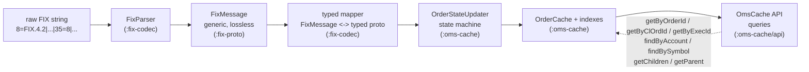
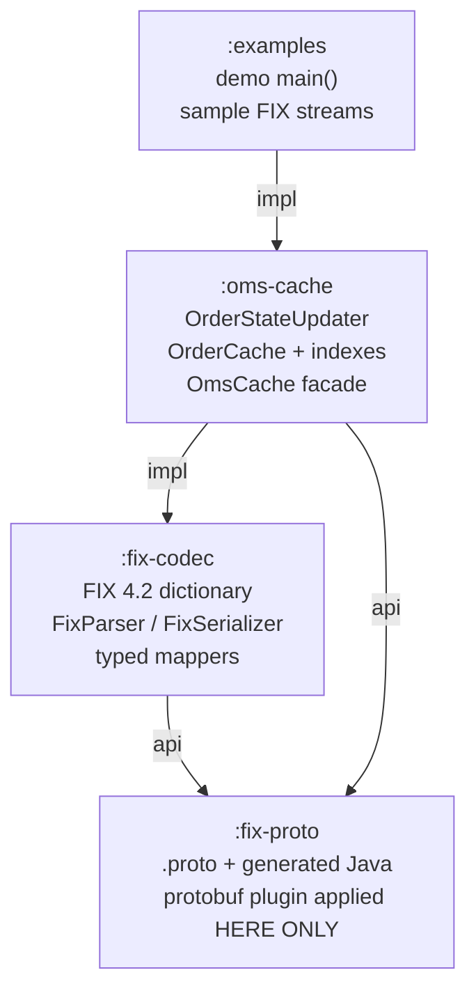

# Architecture & Gradle Multi-Module Build

> **Design draft.** This document is part of the design exploration. For the authoritative, reconciled decisions and the corrections applied after review, see [00-overview.md](00-overview.md).


This document describes the overall architecture of **fix42-oms-cache** and the
Gradle multi-module build that produces it. It is the authoritative reference
for how a raw FIX 4.2 string flows through the system into the in-memory order
cache, how the four Gradle submodules are wired together, and how the build is
configured (protobuf codegen, version catalog, Java 23 toolchain).

- **Goal:** consume FIX 4.2 audit-trail / drop-copy streams and maintain an
  in-memory cache of the *latest state* of every order (parent and child), plus
  the full joined message history per order.
- **Codec:** a FIX 4.2 `<->` protobuf codec (parse FIX string to protobuf,
  serialize protobuf back to FIX string), driven by a FIX 4.2 data dictionary.
- **Root package:** `com.fix42.oms`
- **Tech baseline (fixed):** Java 23, Gradle 9.2.1 multi-module,
  protobuf-java 4.35.1 (proto3), JUnit 5.

---

## 1. High-level data flow

The library is a pipeline. A raw FIX message enters as a `String` (or as an
already-parsed generic `FixMessage`), is parsed and mapped to typed protobuf,
run through the order state machine, folded into the cache, and finally made
queryable through the `OmsCache` facade.



ASCII rendering of the same flow (for terminals / plain diff viewers):

```
 raw FIX string
      |
      v
 [FixParser]                :fix-codec   -- tokenizes 8=..|9=..|35=..|10=..
      |
      v
 [FixMessage]               :fix-proto   -- generic, ordered, lossless wire model
      |
      v
 [typed mapper]             :fix-codec   -- dictionary-driven FixMessage <-> typed proto
      |                                     (NewOrderSingle, ExecutionReport, ...)
      v
 [OrderStateUpdater]        :oms-cache   -- state machine: apply msg -> mutate OrderState
      |
      v
 [OrderCache + indexes]     :oms-cache   -- primary + 6 secondary concurrent indexes
      |
      v
 [OmsCache API]             :oms-cache   -- process(...) + get*/find*/getChildren/getParent
```

### 1.1 What each stage does

| Stage | Input | Output | Responsibility |
|-------|-------|--------|----------------|
| `FixParser` | `String` raw FIX | `FixMessage` | Split on SOH (`0x01`), parse `tag=value`, preserve order incl. header/trailer, lossless. No semantic interpretation. |
| typed mapper | `FixMessage` | typed proto (e.g. `ExecutionReport`) | Dictionary-driven field extraction, repeating-group assembly, enum char-code mapping. |
| `OrderStateUpdater` | typed proto + current `OrderState` | mutated `OrderState` | Pure state-machine logic: which fields change, chain linking, terminal detection. |
| `OrderCache` | `OrderState` | indexed store | Store latest state, maintain all indexes atomically, append to `message_history`. |
| `OmsCache` | `String` / `FixMessage` / typed proto | `OrderState` + query results | Public facade: dispatch by `35=`, expose queries. Thread-safe. |

> The reverse direction (protobuf `->` FIX string) uses `FixSerializer`
> (`:fix-codec`), which walks a `FixMessage` and re-emits `tag=value<SOH>` in
> stored order, recomputing `9` (BodyLength) and `10` (CheckSum). Typed protos
> are first converted back to a generic `FixMessage` by the same mappers.

---

## 2. Gradle submodules

Four submodules, strict one-directional dependency edges. The split exists to
isolate three concerns that change for independent reasons: **codegen**,
**wire format**, and **cache/domain logic**.



ASCII:

```
   :examples
       |  (implementation)
       v
   :oms-cache ------------------+
       |  (implementation)      | (api: uses generated protos directly)
       v                        v
   :fix-codec  --(api)-->  :fix-proto
```

### 2.1 Responsibilities and rationale

| Module | Depends on | Responsibility | Why it is separate |
|--------|-----------|----------------|--------------------|
| `:fix-proto` | — | `.proto` sources (`fix.proto`, `order_state.proto`, `messages.proto`) + generated Java. The **only** module applying `com.google.protobuf`. Re-exposes generated classes as `api`. | **Isolate codegen.** protoc/plugin quirks, generated-source wiring, and the protobuf-java dependency are contained here. If the plugin breaks on a Gradle upgrade, only this module changes. |
| `:fix-codec` | `:fix-proto` (`api`) | FIX 4.2 data dictionary, `FixParser`, `FixSerializer`, typed mappers (`FixMessage <-> typed protos`). | **No cache knowledge.** The codec knows FIX tags and proto shapes but nothing about `OrderState`, indexes, or the state machine. It is reusable for any FIX-to-proto task. |
| `:oms-cache` | `:fix-codec` (`impl`), `:fix-proto` (`api`) | `OrderStateUpdater` (state machine), `OrderCache` + 7 indexes, `OmsCache` facade, parent/child linking, `ParentLinkResolver`. | **No wire-format knowledge beyond the codec.** The cache never parses raw FIX itself; it calls `FixParser`/mappers. Its concern is *state*, not *bytes*. |
| `:examples` | `:oms-cache` (`impl`) | Runnable `main()` demo + sample FIX streams. | Keeps demo/sample data out of the shipped libraries; depends only on the public `OmsCache` API. |

Why `:oms-cache` also declares an `api` edge to `:fix-proto`: the public
`OmsCache` methods return `OrderState` (a generated proto) and accept
`FixMessage`, so those generated types are part of `:oms-cache`'s **published
API surface** and must transit to consumers.

> **Open question:** The anchor lists `:oms-cache` depending on both
> `:fix-codec` **and** `:fix-proto`. `:fix-codec` already re-exposes
> `:fix-proto` transitively via `api`, so the explicit `:fix-proto` edge is
> redundant for compilation. It is kept intentionally to make the proto
> dependency **direct and visible** (Gradle best practice: declare what you
> use directly), and is documented here rather than silently dropped.

---

## 3. Gradle wiring (Groovy DSL)

All snippets below are copy-pastable and use the exact versions from the
project anchor. Groovy DSL (`build.gradle`, not `.kts`).

### 3.1 `settings.gradle` (root)

```groovy
rootProject.name = 'fix42-oms-cache'

// Gradle 9 reads the version catalog from gradle/libs.versions.toml automatically.
// No explicit dependencyResolutionManagement block is required for that default.

include ':fix-proto'
include ':fix-codec'
include ':oms-cache'
include ':examples'
```

### 3.2 `gradle/libs.versions.toml` (version catalog)

```toml
[versions]
protobuf       = "4.35.1"
protobufPlugin = "0.9.5"
junit          = "5.11.4"
caffeine       = "3.1.8"   # OPTIONAL add-on (TTL eviction of terminal orders); not a required dep

[libraries]
protobuf-java      = { module = "com.google.protobuf:protobuf-java",   version.ref = "protobuf" }
# protoc executable pulled as a Maven artifact; used both by the plugin and by the fallback exec task
protobuf-protoc    = { module = "com.google.protobuf:protoc",          version.ref = "protobuf" }
junit-jupiter      = { module = "org.junit.jupiter:junit-jupiter",     version.ref = "junit" }
junit-platform-launcher = { module = "org.junit.platform:junit-platform-launcher" }
caffeine           = { module = "com.github.ben-manes.caffeine:caffeine", version.ref = "caffeine" }

[plugins]
protobuf = { id = "com.google.protobuf", version.ref = "protobufPlugin" }
```

> Runtime dependency of the shipped library is **protobuf-java only**. JUnit is
> test-only; Caffeine is an optional documented add-on and is deliberately kept
> out of any `api`/`implementation` scope of the core modules.

### 3.3 Root `build.gradle` — shared conventions

```groovy
// Root build: shared config applied to every subproject. No plugins applied at root.
subprojects {
    apply plugin: 'java-library'

    group   = 'com.fix42.oms'
    version = '0.1.0-SNAPSHOT'

    java {
        toolchain {
            languageVersion = JavaLanguageVersion.of(23)
        }
    }

    repositories {
        mavenCentral()
    }

    tasks.withType(JavaCompile).configureEach {
        options.encoding = 'UTF-8'
    }

    // JUnit 5 for every module.
    dependencies {
        testImplementation libs.junit.jupiter
        testRuntimeOnly    libs.junit.platform.launcher
    }

    tasks.named('test') {
        useJUnitPlatform()
    }
}
```

### 3.4 `:fix-proto/build.gradle` — codegen module (primary path)

This is the **only** module that applies the protobuf plugin. It compiles the
`.proto` files with **protoc 4.35.1** and re-exposes the generated classes plus
`protobuf-java` as `api`, so downstream modules see them transitively.

```groovy
plugins {
    id 'java-library'
    alias(libs.plugins.protobuf)
}

dependencies {
    // 'api' so generated messages AND the protobuf runtime flow to :fix-codec / :oms-cache
    api libs.protobuf.java
}

protobuf {
    // Pin protoc to 4.35.1 (matches protobuf-java 4.35.1). Downloaded from Maven Central.
    protoc {
        artifact = "com.google.protobuf:protoc:${libs.versions.protobuf.get()}"
    }
    // proto3, java_package = com.fix42.oms.proto (declared inside each .proto)
    // Default generateProtoTasks produces standard Java sources into build/generated/source/proto.
}

// Generated sources live under build/generated/... ; the protobuf plugin wires them
// into the 'main' sourceSet automatically. Nothing extra needed for the primary path.
```

Layout of this module:

```
fix-proto/
  build.gradle
  src/main/proto/
    fix.proto            # FixField, FixMessage (generic lossless wire model)
    order_state.proto    # OrderState (cache VALUE) + enums
    messages.proto       # 7 typed messages + FixHeader/FixTrailer + repeating groups
```

### 3.5 Fallback: `protoc-exec` if the plugin is incompatible with Gradle 9

If `com.google.protobuf` (Gradle plugin) cannot run under Gradle 9.2.1, drop
the plugin and drive the **protoc Maven artifact** directly with a custom
`Exec` task. The `.proto` inputs, `java_package`, and output are identical, so
downstream modules are unaffected.

```groovy
plugins {
    id 'java-library'
    // NOTE: protobuf plugin intentionally NOT applied in the fallback path.
}

dependencies {
    api libs.protobuf.java
}

// Resolve the protoc executable artifact (com.google.protobuf:protoc:4.35.1)
// into an isolated configuration so we get the platform-specific binary.
configurations { protocTool }
dependencies {
    protocTool "com.google.protobuf:protoc:${libs.versions.protobuf.get()}@exe"
}

def protoSrcDir = layout.projectDirectory.dir('src/main/proto')
def protoOutDir = layout.buildDirectory.dir('generated/source/proto/main/java')

def generateProto = tasks.register('generateProto', Exec) {
    group = 'protobuf'
    description = 'Generate Java from .proto using protoc 4.35.1 (Gradle-9 fallback path)'

    inputs.dir(protoSrcDir)
    outputs.dir(protoOutDir)

    doFirst {
        protoOutDir.get().asFile.mkdirs()
        def protoc = configurations.protocTool.singleFile
        protoc.setExecutable(true)   // Maven .exe artifact arrives without +x on *nix
        def protos = fileTree(protoSrcDir) { include '**/*.proto' }.files.collect { it.absolutePath }
        commandLine([protoc.absolutePath,
                     "--proto_path=${protoSrcDir.asFile.absolutePath}",
                     "--java_out=${protoOutDir.get().asFile.absolutePath}"] + protos)
    }
}

// Feed the generated sources into the main compilation and order the tasks.
sourceSets {
    main {
        java {
            srcDir protoOutDir
        }
    }
}
tasks.named('compileJava') { dependsOn generateProto }
```

Both paths produce Java classes in package `com.fix42.oms.proto` under
`build/generated/source/proto/main/java`, so `:fix-codec` and `:oms-cache`
compile against them identically regardless of which path is active.

### 3.6 `:fix-codec/build.gradle`

```groovy
plugins { id 'java-library' }

dependencies {
    // 'api' — codec's public surface returns/accepts generated protos (FixMessage, typed msgs)
    api project(':fix-proto')
}
```

### 3.7 `:oms-cache/build.gradle`

```groovy
plugins { id 'java-library' }

dependencies {
    implementation project(':fix-codec')   // parser/serializer/mappers, internal use
    api            project(':fix-proto')   // OrderState/FixMessage are on the public API surface

    // Optional TTL add-on. Left out of default builds; enable per deployment.
    // implementation libs.caffeine
}
```

### 3.8 `:examples/build.gradle`

```groovy
plugins {
    id 'java-library'
    id 'application'
}

dependencies {
    implementation project(':oms-cache')
}

application {
    mainClass = 'com.fix42.oms.examples.DemoMain'
}
```

---

## 4. Package layout under `com.fix42.oms`

Package roots map cleanly onto module boundaries. No package spans two modules.

```
com.fix42.oms
├── proto        (:fix-proto,  GENERATED)  FixField, FixMessage, OrderState, enums,
│                                          the 7 typed messages, FixHeader/FixTrailer,
│                                          repeating-group sub-messages
├── fix          (:fix-codec)  FixParser, FixSerializer (raw string <-> FixMessage)
├── dict         (:fix-codec)  FIX 4.2 data dictionary: tag numbers, types,
│                              repeating-group definitions, enum char-code tables
├── mapper       (:fix-codec)  dictionary-driven FixMessage <-> typed proto converters
├── model        (:oms-cache)  OrderStateUpdater (state machine), ParentLinkResolver,
│                              terminal-state helpers
├── cache        (:oms-cache)  OrderCache + the 7 indexes
└── api          (:oms-cache)  OmsCache facade (public entry point)
```

| Package | Module | Key types |
|---------|--------|-----------|
| `com.fix42.oms.proto` | `:fix-proto` | `FixMessage`, `FixField`, `OrderState`, `ExecutionReport`, `Side`, `OrdStatus`, `ExecType`, ... (all generated) |
| `com.fix42.oms.fix` | `:fix-codec` | `FixParser`, `FixSerializer` |
| `com.fix42.oms.dict` | `:fix-codec` | `Fix42Dictionary`, `FieldDef`, `GroupDef`, enum code maps |
| `com.fix42.oms.mapper` | `:fix-codec` | `NewOrderSingleMapper`, `ExecutionReportMapper`, ... |
| `com.fix42.oms.model` | `:oms-cache` | `OrderStateUpdater`, `ParentLinkResolver`, `DefaultParentLinkResolver` |
| `com.fix42.oms.cache` | `:oms-cache` | `OrderCache` |
| `com.fix42.oms.api` | `:oms-cache` | `OmsCache` |

---

## 5. The cache: value type, indexes, linking

### 5.1 Cache value

The cache value is the generated `OrderState` proto (from `order_state.proto`),
chosen over `Map<String,Object>` / JSON for type safety, compact binary form,
schema evolution, and zero hand-written serialization. Its fields carry the
latest state plus `repeated FixMessage message_history` (all original parsed
messages, in arrival order) so every order's full joined history is retained.

Selected field-to-tag mapping (names exactly as in the anchor proto):

| Proto field | FIX tag | Notes |
|-------------|--------|-------|
| `order_id` | 37 | sell-side assigned; stable across a chain; first seen on first `35=8` |
| `cl_ord_id` | 11 | current (originator, new per `D`/`F`/`G`) |
| `orig_cl_ord_id` | 41 | latest; on `F`/`G` points to the `ClOrdID` being canceled/replaced |
| `ord_status` | 39 | driven by `35=8` |
| `last_exec_type` | 150 | driven by `35=8` |
| `cum_qty` / `leaves_qty` / `avg_px` | 14 / 151 / 6 | running fill state |
| `ord_rej_reason` | 103 | from `35=8` reject |
| `cxl_rej_reason` | 102 | from `35=9` OrderCancelReject |

> **FIX 4.2 correctness note on parent linking:** FIX 4.2 has **no standard
> parent-order tag**. The default `ParentLinkResolver` reads tag **526
> (SecondaryClOrdID)** as the configurable parent link. Tag 526 exists in the
> FIX 4.2 dictionary but is not semantically a "parent order id" — this is an
> explicit, documented, overridable design decision, not a FIX standard. Tags
> like `1080 (RootID)` / `1081 (ParentMktSegmID)` belong to **later FIX
> versions** and are deliberately not used here.

### 5.2 Indexes (all concurrent, in `:oms-cache`)

| Index | Type | Purpose |
|-------|------|---------|
| primary | `orderId -> OrderState` | canonical store |
| `pendingByClOrdId` | `clOrdId -> OrderState` | orders with no `OrderID` yet (pre-first-`35=8`) |
| `clOrdIdIndex` | `clOrdId -> orderId` | every `ClOrdID` in the chain |
| `execIdIndex` | `execId -> orderId` | lookup by `ExecID (17)` |
| `accountIndex` | `account -> Set<orderId>` | `findByAccount` |
| `symbolIndex` | `symbol -> Set<orderId>` | `findBySymbol` |
| `parentIndex` | `parentOrderId -> Set<childOrderId>` | `getChildren` / `getParent` |

Chain resolution: keep `clOrdId -> orderId`; when only `ClOrdID` is known
(pre-`OrderID`), key the order in `pendingByClOrdId` and reconcile into the
primary index when the first `35=8` assigns an `OrderID (37)`.

---

## 6. Threading & concurrency model

**Guarantee: `OmsCache` is thread-safe for concurrent `process*` and query
calls.** Design overview:

- **Per-order serialization.** All mutation for a single order is serialized on
  that order's key (e.g. a striped lock keyed by `orderId`, or compute-style
  atomic updates on the primary `ConcurrentHashMap`). Two messages for the same
  order never interleave; messages for *different* orders proceed in parallel.
- **Concurrent indexes.** Every index is a concurrent map
  (`ConcurrentHashMap`; `Set` values are concurrent sets). The primary index
  and secondary indexes are updated within the same per-order critical section
  so a query never observes an order present in a secondary index but missing
  from the primary.
- **Immutable published value.** `OrderState` is an immutable protobuf message.
  `OrderStateUpdater` builds a new `OrderState` from the current one via its
  builder and atomically swaps it in. Readers therefore always see a fully
  consistent snapshot; there is no partial-update visibility.
- **Message history append.** Each accepted message is appended to
  `message_history` as part of the same atomic state swap, preserving arrival
  order per order.
- **Query semantics.** `get*`/`find*` are lock-light: they read from concurrent
  indexes and return immutable `OrderState` snapshots. `findByAccount` /
  `findBySymbol` return a point-in-time view of the matching set.
- **Codec is stateless.** `FixParser`, `FixSerializer`, and the mappers hold no
  per-message mutable state and are safe to share across threads. The
  `Fix42Dictionary` is effectively immutable after construction.

> Ordering caveat: correctness of the state machine assumes a **per-order**
> message stream is applied in arrival order. Concurrency parallelizes *across*
> orders, not *within* one order.

---

## 7. Public API surface

`com.fix42.oms.api.OmsCache` (exact names from the anchor):

```java
// dispatch / ingest
OrderState process(String rawFix);            // auto-parse + dispatch by 35=
OrderState process(FixMessage message);       // dispatch by msg type

// per-type processors
OrderState processNewOrderSingle(...);
OrderState processExecutionReport(...);
OrderState processOrderCancelReject(...);
OrderState processOrderCancelRequest(...);
OrderState processOrderCancelReplaceRequest(...);
OrderState processOrderStatusRequest(...);
OrderState processDontKnowTrade(...);

// point lookups
OrderState getByOrderId(String orderId);
OrderState getByClOrdId(String clOrdId);
OrderState getByExecId(String execId);

// searches / linking
Collection<OrderState> findByAccount(String account);
Collection<OrderState> findBySymbol(String symbol);
Collection<OrderState> getChildren(String parentOrderId);
OrderState             getParent(String childOrderId);
```

The 7 in-scope FIX 4.2 message types: `35=D` NewOrderSingle, `35=8`
ExecutionReport, `35=9` OrderCancelReject, `35=F` OrderCancelRequest, `35=G`
OrderCancelReplaceRequest, `35=H` OrderStatusRequest, `35=Q` DontKnowTrade.

---

## 8. Build & test commands

| Command | Effect |
|---------|--------|
| `./gradlew build` | Compile every module (runs protoc codegen in `:fix-proto` first), run all tests, assemble jars. |
| `./gradlew :fix-proto:generateProto` | Force proto codegen only (primary or fallback task name). |
| `./gradlew :oms-cache:test` | Run the cache / state-machine JUnit 5 tests only. |
| `./gradlew :fix-codec:test` | Run parser / serializer / mapper round-trip tests. |
| `./gradlew :examples:run` | Run the demo `main()` against the sample FIX streams. |
| `./gradlew clean build` | Clean + full rebuild (regenerates all proto sources). |

Build order is derived from the dependency graph:
`:fix-proto` -> `:fix-codec` -> `:oms-cache` -> `:examples`. Because
`:fix-proto` re-exposes generated classes and `protobuf-java` as `api`, no
downstream module re-declares the protobuf runtime or re-runs codegen.

---

## 9. Design decisions recap (answers the TODO asked for)

| TODO question | Decision | Where |
|---------------|----------|-------|
| protobuf vs `Map<String,Object>` vs JSON | typed **protobuf** (`OrderState`) — type safety, compactness, schema evolution | §5.1 |
| 3rd-party cache lib vs build from scratch | build a **thin in-memory cache**; Caffeine optional (TTL eviction of terminal orders) | §2.1, §3.2 |
| store all original FIX msgs + join per `orderId` | **yes** — `repeated FixMessage message_history` in arrival order | §5.1 |
| FIX `<->` protobuf incl. repeating groups | generic `FixMessage` round-trip + dictionary-driven typed mappers | §1, §3.4 |
| latest-state fields + how each msg updates them | `OrderState` + `OrderStateUpdater` state machine | §5.1, §6 |
| search by Account/Symbol/ClOrdID/OrderID/ExecID | 7 secondary concurrent indexes | §5.2 |

This architecture keeps codegen quarantined in `:fix-proto`, keeps the codec
free of cache concepts, and keeps the cache free of wire-format concerns beyond
calling the codec — the three axes along which this system is most likely to
change independently.
