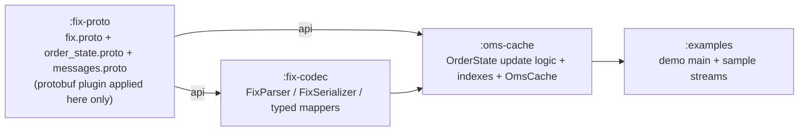

# Protobuf Schema Design

> **Design draft.** This document is part of the design exploration. For the authoritative, reconciled decisions and the corrections applied after review, see [00-overview.md](00-overview.md).


This document specifies the complete proto3 schema for **fix42-oms-cache**. It defines three `.proto` files, each owned by a specific Gradle submodule, and explains the design rationale, the lossless generic wire model, the `OrderState` cache value, every enum with its FIX-4.2 character-code mapping, and the typed message layer.

- `fix.proto` — generic lossless model. Owned by `:fix-proto`.
- `order_state.proto` — the cache **value** + enums. Owned by `:fix-proto`.
- `messages.proto` — typed protos for the 7 in-scope message types. Owned by `:fix-proto`.

All generated Java lives in java package `com.fix42.oms.proto`. The `:fix-codec` module consumes these types; `:oms-cache` builds `OrderState` from them.

---

## 1. Rationale: why typed protobuf

The TODO explicitly asks us to justify **typed protobuf** over `Map<String,Object>` and over JSON. Here is the reasoning that governs every schema decision below.

| Concern | `Map<String,Object>` | JSON | **Typed protobuf (chosen)** |
|---|---|---|---|
| Type safety | None — every read is a cast, tag semantics live in the programmer's head | Weak — numbers are doubles, everything stringly-typed | **Compile-time**: `orderState.getCumQty()` returns `double`, `getOrdStatus()` returns an enum |
| Schema evolution | Ad-hoc; adding a key is invisible to consumers | No schema; breakage found at runtime | **Field numbers are the contract**; add fields without breaking readers; reserved numbers prevent reuse |
| Compactness | Large (boxed objects, String keys per entry) | Verbose UTF-8 with repeated key names | **Varint + field-number tags**; no field names on the wire |
| Direct field updates | `map.put("39", ...)` — no validation | Reparse/rewrite the whole document | **Builders**: `state.toBuilder().setOrdStatus(FILLED).setCumQty(500).build()` |
| Partial updates | Manual | **Awkward** — JSON has no first-class "set one field"; you deserialize the whole object, mutate, reserialize, and re-emit every key | Builder copies the message and overwrites only the touched fields |
| Generated code | None | None (hand-rolled DTOs) | **Generated builders, equals/hashCode, parser** for free |

The FIX audit-trail use case is update-heavy: every `35=8` ExecutionReport mutates a handful of fields on an existing order (`ord_status`, `cum_qty`, `leaves_qty`, `avg_px`, `last_qty`, `last_px`). JSON's "reserialize the whole document to change one field" is exactly the wrong shape. Protobuf's `toBuilder()` merge is exactly the right one:

```java
// Direct, validated, single-field update — the core cache write path
OrderState updated = existing.toBuilder()
    .setOrdStatus(OrdStatus.PARTIALLY_FILLED)
    .setCumQty(cumQty)
    .setLeavesQty(leavesQty)
    .setAvgPx(avgPx)
    .setLastUpdateEpochMillis(now)
    .addMessageHistory(parsedGenericMessage)
    .build();
```

Runtime dependency stays minimal: **protobuf-java only** (per the anchor). Caffeine is an optional TTL add-on, not required.

---

## 2. `fix.proto` — the generic lossless model

FIX is an ordered, tag-delimited, repeating-group-bearing format. Before we impose any typed structure, we keep a **lossless** representation so we can always round-trip back to the exact original bytes. This generic model is the **round-trip vehicle**: the parser produces it, the serializer consumes it, and `OrderState.message_history` stores it.

```proto
syntax = "proto3";
package com.fix42.oms.proto;
option java_package = "com.fix42.oms.proto";
option java_outer_classname = "FixProto";
option java_multiple_files = true;

// One FIX field: tag=value. Value kept as the raw string exactly as on the wire.
message FixField {
  uint32 tag   = 1;  // FIX tag number, e.g. 35, 11, 150
  string value = 2;  // raw value, e.g. "8", "ORD-1", "2"
}

// A full FIX message as an ORDERED list of fields: header + body + trailer.
// Order is significant and preserved => lossless round-trip.
message FixMessage {
  repeated FixField fields = 1;  // arrival order == wire order
}
```

### 2.1 Why order matters, and how repeating groups survive losslessly

In FIX, a repeating group is expressed as a **count tag** (`NoXxx`) followed by *N* consecutive blocks, each block starting with a well-known "delimiter" tag. The group's structure is carried **entirely by field order** — there are no brackets on the wire. Example, a two-fill ContraBroker group inside an ExecutionReport:

```
382=2 | 375=BRKA | 337=T1 | 437=100 | 438=09:30:01 | 375=BRKB | 337=T2 | 437=200 | 438=09:30:02
```

Tag `382` (`NoContraBrokers`) = 2 blocks. Each block begins at the delimiter tag `375` (`ContraBroker`). Because `FixMessage.fields` is a `repeated` list that preserves insertion order, we store these nine fields in exactly this sequence. Nothing is lost, nothing is reordered, and duplicate tags (`375` appears twice) coexist happily — a `Map<Integer,String>` could not represent this at all.

```
FixMessage.fields (ordered):
  ┌──────────────────────────────────────────────────────────────────┐
  │ 35=8 │ 37=ORD1 │ 17=E1 │ 150=2 │ 39=2 │ 382=2 │                    │
  │      group block #1 →  375=BRKA │337=T1│437=100│438=09:30:01 │     │
  │      group block #2 →  375=BRKB │337=T2│437=200│438=09:30:02 │ ... │
  └──────────────────────────────────────────────────────────────────┘
```

The typed layer (`messages.proto`) re-expresses these blocks as nested `repeated` submessages for ergonomic access, but the **generic `FixMessage` is authoritative** for round-trip fidelity. Serialization is: iterate `fields`, emit `tag=value<SOH>`, recompute `9=BodyLength` and `10=CheckSum`.

> **Open question:** `9` (BodyLength) and `10` (CheckSum) are derived. We store them in `FixMessage` for true byte-for-byte fidelity, but the `FixSerializer` recomputes them on write. If an inbound audit message has an incorrect checksum, the stored value and the recomputed value will differ — the codec keeps the original in `message_history` and flags the mismatch rather than silently rewriting it.

---

## 3. `order_state.proto` — the cache value + enums

This is the value stored in the primary index (`orderId -> OrderState`). Field names are **snake_case** in proto (generating `getCamelCase()` accessors in Java) and match the anchor exactly. FIX tag numbers are noted in comments.

```proto
syntax = "proto3";
package com.fix42.oms.proto;
option java_package = "com.fix42.oms.proto";
option java_outer_classname = "OrderStateProto";
option java_multiple_files = true;

import "fix.proto";

message OrderState {
  // ---- Identity / linking ----
  string order_id       = 1;   // tag 37, sell-side id, stable across chain
  string cl_ord_id      = 2;   // tag 11, CURRENT client order id
  string orig_cl_ord_id = 3;   // tag 41, latest OrigClOrdID seen (chain link)

  // ---- Static order attributes ----
  string account      = 4;   // tag 1
  string symbol       = 5;   // tag 55
  Side side           = 6;   // tag 54
  OrdType ord_type    = 7;   // tag 40
  double order_qty    = 8;   // tag 38 (FIX 4.2: "OrderQty")
  double price        = 9;   // tag 44
  double stop_px      = 10;  // tag 99
  TimeInForce time_in_force = 11; // tag 59
  string currency     = 12;  // tag 15

  // ---- Latest execution state ----
  OrdStatus ord_status     = 13;  // tag 39
  ExecType last_exec_type  = 14;  // tag 150
  double cum_qty           = 15;  // tag 14
  double leaves_qty        = 16;  // tag 151 (added in FIX 4.2)
  double avg_px            = 17;  // tag 6
  double last_qty          = 18;  // tag 32 (FIX 4.2: "LastShares")
  double last_px           = 19;  // tag 31
  string last_market       = 20;  // tag 30 (FIX 4.2: "LastMkt")

  // ---- Parent/child linking ----
  string parent_order_id           = 21;
  repeated string child_order_ids  = 22;
  bool is_parent                   = 23;

  // ---- Bookkeeping ----
  int64 first_seen_epoch_millis   = 24;
  int64 last_update_epoch_millis  = 25;
  string last_msg_type            = 26;  // tag 35 of most recent message

  // ---- History / dedup ----
  repeated string cl_ord_id_history = 27;  // every ClOrdID in the chain
  repeated string exec_ids          = 28;  // tag 17 values seen

  // ---- Reject / free text ----
  string text            = 29;  // tag 58
  int32 ord_rej_reason   = 30;  // tag 103
  int32 cxl_rej_reason   = 31;  // tag 102

  // ---- Full joined history ----
  repeated FixMessage message_history = 32; // all parsed messages, arrival order
}
```

Notes:
- `order_qty`, `last_qty`, `price` etc. are `double`. FIX transmits these as decimal strings; the codec parses them. For venues requiring exact decimal semantics, a future variant could store the raw string alongside — see open question below.
- `message_history` reuses `FixMessage` from `fix.proto` — the full audit trail joined per `order_id` (answers TODO item 3).

> **Open question:** `double` for quantities and prices is lossy for some decimal values (e.g. tick sizes). The anchor specifies `double`, so we keep it, but flag that a fixed-point representation (store the raw FIX string, parse on demand) may be required for regulatory-grade price fidelity. The lossless raw value is always recoverable from `message_history`.

### 3.1 Enums — proto3 rules and FIX 4.2 code mappings

**proto3 rule:** every enum's first value must be `0`, used here as `*_UNSPECIFIED`. The enum's *numeric* value is semantic and internal — it is **not** the FIX character code. The FIX char code is a `string`/`char` on the wire and is mapped in the codec via lookup tables. The mapping tables below are the source of truth for those lookups.

#### Side (tag 54)

```proto
enum Side {
  SIDE_UNSPECIFIED = 0;
  BUY              = 1;  // '1'
  SELL             = 2;  // '2'
  BUY_MINUS        = 3;  // '3'
  SELL_PLUS        = 4;  // '4'
  SELL_SHORT       = 5;  // '5'
  SELL_SHORT_EXEMPT= 6;  // '6'
  UNDISCLOSED      = 7;  // '7'
  CROSS            = 8;  // '8'
  CROSS_SHORT      = 9;  // '9'
}
```

| FIX code | Enum |
|---|---|
| `1` | BUY |
| `2` | SELL |
| `3` | BUY_MINUS |
| `4` | SELL_PLUS |
| `5` | SELL_SHORT |
| `6` | SELL_SHORT_EXEMPT |
| `7` | UNDISCLOSED |
| `8` | CROSS |
| `9` | CROSS_SHORT |

#### OrdType (tag 40)

```proto
enum OrdType {
  ORD_TYPE_UNSPECIFIED = 0;
  MARKET               = 1;  // '1'
  LIMIT                = 2;  // '2'
  STOP                 = 3;  // '3'
  STOP_LIMIT           = 4;  // '4'
}
```

| FIX code | Enum |
|---|---|
| `1` | MARKET |
| `2` | LIMIT |
| `3` | STOP |
| `4` | STOP_LIMIT |

FIX 4.2 defines further OrdType codes (`5`=Market On Close, `6`=With Or Without, `7`=Limit Or Better, `P`=Pegged, etc.). Only the four in-scope trading types are modeled per the anchor; unknown codes map to `ORD_TYPE_UNSPECIFIED` and the raw value stays in `message_history`.

#### TimeInForce (tag 59)

```proto
enum TimeInForce {
  TIME_IN_FORCE_UNSPECIFIED = 0;
  DAY  = 1;  // '0'
  GTC  = 2;  // '1'  Good Till Cancel
  IOC  = 3;  // '3'  Immediate Or Cancel
  FOK  = 4;  // '4'  Fill Or Kill
  GTD  = 5;  // '6'  Good Till Date
}
```

| FIX code | Enum | Meaning |
|---|---|---|
| `0` | DAY | Day |
| `1` | GTC | Good Till Cancel |
| `2` | — | *At the Opening (OPG) — valid FIX 4.2, not in scope* |
| `3` | IOC | Immediate Or Cancel |
| `4` | FOK | Fill Or Kill |
| `5` | — | *Good Till Crossing (GTX) — valid FIX 4.2, not in scope* |
| `6` | GTD | Good Till Date |

Note the **non-contiguous** FIX codes (`2` and `5` exist in FIX 4.2 but are out of scope). This is exactly why the enum numeric value must not equal the FIX code.

#### OrdStatus (tag 39)

```proto
enum OrdStatus {
  ORD_STATUS_UNSPECIFIED = 0;
  NEW               = 1;  // '0'
  PARTIALLY_FILLED  = 2;  // '1'
  FILLED            = 3;  // '2'
  DONE_FOR_DAY      = 4;  // '3'
  CANCELED          = 5;  // '4'
  REPLACED          = 6;  // '5'
  PENDING_CANCEL    = 7;  // '6'
  STOPPED           = 8;  // '7'
  REJECTED          = 9;  // '8'
  SUSPENDED         = 10; // '9'
  PENDING_NEW       = 11; // 'A'
  CALCULATED        = 12; // 'B'
  EXPIRED           = 13; // 'C'
  ACCEPTED_FOR_BIDDING = 14; // 'D'
  PENDING_REPLACE   = 15; // 'E'
}
```

| FIX code | Enum |
|---|---|
| `0` | NEW |
| `1` | PARTIALLY_FILLED |
| `2` | FILLED |
| `3` | DONE_FOR_DAY |
| `4` | CANCELED |
| `5` | REPLACED |
| `6` | PENDING_CANCEL |
| `7` | STOPPED |
| `8` | REJECTED |
| `9` | SUSPENDED |
| `A` | PENDING_NEW |
| `B` | CALCULATED |
| `C` | EXPIRED |
| `D` | ACCEPTED_FOR_BIDDING |
| `E` | PENDING_REPLACE |

#### ExecType (tag 150)

In **FIX 4.2** ExecType shares the same letter codes as OrdStatus, and crucially still carries `1`=Partial Fill and `2`=Fill as distinct values (these were merged into `F`=Trade in FIX 4.3+). It adds `D`=Restated.

```proto
enum ExecType {
  EXEC_TYPE_UNSPECIFIED = 0;
  EXEC_NEW              = 1;  // '0'
  EXEC_PARTIAL_FILL     = 2;  // '1'
  EXEC_FILL             = 3;  // '2'
  EXEC_DONE_FOR_DAY     = 4;  // '3'
  EXEC_CANCELED         = 5;  // '4'
  EXEC_REPLACED         = 6;  // '5'
  EXEC_PENDING_CANCEL   = 7;  // '6'
  EXEC_STOPPED          = 8;  // '7'
  EXEC_REJECTED         = 9;  // '8'
  EXEC_SUSPENDED        = 10; // '9'
  EXEC_PENDING_NEW      = 11; // 'A'
  EXEC_CALCULATED       = 12; // 'B'
  EXEC_EXPIRED          = 13; // 'C'
  EXEC_RESTATED         = 14; // 'D'
  EXEC_PENDING_REPLACE  = 15; // 'E'
}
```

| FIX code | Enum |
|---|---|
| `0` | EXEC_NEW |
| `1` | EXEC_PARTIAL_FILL |
| `2` | EXEC_FILL |
| `3` | EXEC_DONE_FOR_DAY |
| `4` | EXEC_CANCELED |
| `5` | EXEC_REPLACED |
| `6` | EXEC_PENDING_CANCEL |
| `7` | EXEC_STOPPED |
| `8` | EXEC_REJECTED |
| `9` | EXEC_SUSPENDED |
| `A` | EXEC_PENDING_NEW |
| `B` | EXEC_CALCULATED |
| `C` | EXEC_EXPIRED |
| `D` | EXEC_RESTATED |
| `E` | EXEC_PENDING_REPLACE |

> Note the deliberate `EXEC_` prefix on every value. proto3 enum value names share a C++-style namespace **within a file**; `NEW`, `FILLED`, etc. are already taken by `OrdStatus`. Prefixing avoids the "enum value already defined" compile error and keeps both enums in one file.

#### ExecTransType (tag 20)

Used with `ExecRefID` (tag 19) to cancel/correct a previously reported execution.

```proto
enum ExecTransType {
  EXEC_TRANS_TYPE_UNSPECIFIED = 0;
  EXEC_TRANS_NEW     = 1;  // '0'
  EXEC_TRANS_CANCEL  = 2;  // '1'
  EXEC_TRANS_CORRECT = 3;  // '2'
  EXEC_TRANS_STATUS  = 4;  // '3'
}
```

| FIX code | Enum |
|---|---|
| `0` | EXEC_TRANS_NEW |
| `1` | EXEC_TRANS_CANCEL |
| `2` | EXEC_TRANS_CORRECT |
| `3` | EXEC_TRANS_STATUS |

#### CxlRejResponseTo (tag 434)

Present on `35=9` OrderCancelReject; tells you whether the reject answers an `F` or a `G`.

```proto
enum CxlRejResponseTo {
  CXL_REJ_RESPONSE_TO_UNSPECIFIED = 0;
  ORDER_CANCEL_REQUEST         = 1;  // '1'
  ORDER_CANCEL_REPLACE_REQUEST = 2;  // '2'
}
```

| FIX code | Enum |
|---|---|
| `1` | ORDER_CANCEL_REQUEST |
| `2` | ORDER_CANCEL_REPLACE_REQUEST |

---

## 4. `messages.proto` — typed messages

Typed protos give ergonomic, compile-checked access to the 7 in-scope message types. Conversion `FixMessage <-> typed` is **dictionary-driven** by the `:fix-codec` mappers: the data dictionary knows which tag maps to which typed field and which tags form repeating groups. The typed layer is a *convenience view*; `FixMessage` remains the lossless source.

### 4.1 Shared header, trailer, and repeating-group submessage

```proto
syntax = "proto3";
package com.fix42.oms.proto;
option java_package = "com.fix42.oms.proto";
option java_outer_classname = "MessagesProto";
option java_multiple_files = true;

import "order_state.proto";

// Standard header (subset relevant to the 7 in-scope types).
message FixHeader {
  string begin_string   = 1;  // tag 8,  "FIX.4.2"
  uint32 body_length    = 2;  // tag 9   (derived on serialize)
  string msg_type       = 3;  // tag 35
  string sender_comp_id = 4;  // tag 49
  string target_comp_id = 5;  // tag 56
  uint32 msg_seq_num    = 6;  // tag 34
  string sending_time   = 7;  // tag 52  (UTCTimestamp string)
}

// Standard trailer.
message FixTrailer {
  string check_sum = 1;  // tag 10 (derived on serialize)
}

// Repeating group: NoContraBrokers (382) on ExecutionReport.
// Delimiter tag is 375 (ContraBroker).
message ContraBroker {
  string contra_broker    = 1;  // tag 375 (delimiter)
  string contra_trader    = 2;  // tag 337
  double contra_trade_qty = 3;  // tag 437
  string contra_trade_time= 4;  // tag 438
}
```

### 4.2 NewOrderSingle (`35=D`) — full

```proto
message NewOrderSingle {
  FixHeader header       = 1;
  string cl_ord_id       = 2;   // tag 11
  string account         = 3;   // tag 1
  string symbol          = 4;   // tag 55
  Side side              = 5;   // tag 54
  string transact_time   = 6;   // tag 60 (UTCTimestamp)
  OrdType ord_type       = 7;   // tag 40
  double order_qty       = 8;   // tag 38
  double price           = 9;   // tag 44 (required for LIMIT/STOP_LIMIT)
  double stop_px         = 10;  // tag 99 (required for STOP/STOP_LIMIT)
  TimeInForce time_in_force = 11; // tag 59
  string expire_time     = 12;  // tag 126 (required when time_in_force = GTD)
  string currency        = 13;  // tag 15
  string secondary_cl_ord_id = 14; // tag 526 — parent link (see §5)
  string text            = 15;  // tag 58
  FixTrailer trailer     = 16;
}
```

### 4.3 ExecutionReport (`35=8`) — full

```proto
message ExecutionReport {
  FixHeader header       = 1;
  string order_id        = 2;   // tag 37
  string cl_ord_id       = 3;   // tag 11
  string orig_cl_ord_id  = 4;   // tag 41 (on responses to F/G)
  string exec_id         = 5;   // tag 17
  ExecTransType exec_trans_type = 6; // tag 20
  string exec_ref_id     = 7;   // tag 19 (when trans_type = CANCEL/CORRECT)
  ExecType exec_type     = 8;   // tag 150
  OrdStatus ord_status   = 9;   // tag 39
  string account         = 10;  // tag 1
  string symbol          = 11;  // tag 55
  Side side              = 12;  // tag 54
  double order_qty       = 13;  // tag 38
  double last_qty        = 14;  // tag 32 (FIX 4.2 "LastShares")
  double last_px         = 15;  // tag 31
  string last_market     = 16;  // tag 30 (FIX 4.2 "LastMkt")
  double leaves_qty      = 17;  // tag 151
  double cum_qty         = 18;  // tag 14
  double avg_px          = 19;  // tag 6
  int32 ord_rej_reason   = 20;  // tag 103 (when ord_status = REJECTED)
  string text            = 21;  // tag 58
  repeated ContraBroker contra_brokers = 22; // group 382
  FixTrailer trailer     = 23;
}
```

### 4.4 OrderCancelReplaceRequest (`35=G`) — full

```proto
message OrderCancelReplaceRequest {
  FixHeader header       = 1;
  string cl_ord_id       = 2;   // tag 11  NEW id for the replacement
  string orig_cl_ord_id  = 3;   // tag 41  id being replaced (chain link)
  string order_id        = 4;   // tag 37  (if known)
  string account         = 5;   // tag 1
  string symbol          = 6;   // tag 55
  Side side              = 7;   // tag 54
  string transact_time   = 8;   // tag 60
  OrdType ord_type       = 9;   // tag 40
  double order_qty       = 10;  // tag 38  (new quantity)
  double price           = 11;  // tag 44  (new price)
  double stop_px         = 12;  // tag 99
  TimeInForce time_in_force = 13; // tag 59
  string secondary_cl_ord_id = 14; // tag 526 — parent link
  string text            = 15;  // tag 58
  FixTrailer trailer     = 16;
}
```

### 4.5 The remaining four typed messages

| Message | MsgType | Key typed fields (tag) |
|---|---|---|
| **OrderCancelRequest** | `35=F` | `cl_ord_id` (11, new), `orig_cl_ord_id` (41, target), `order_id` (37), `symbol` (55), `side` (54), `order_qty` (38), `transact_time` (60), `text` (58) |
| **OrderCancelReject** | `35=9` | `order_id` (37), `cl_ord_id` (11), `orig_cl_ord_id` (41), `ord_status` (39), `cxl_rej_response_to` (434), `cxl_rej_reason` (102), `text` (58) |
| **OrderStatusRequest** | `35=H` | `cl_ord_id` (11), `order_id` (37), `symbol` (55), `side` (54) |
| **DontKnowTrade** | `35=Q` | `order_id` (37), `exec_id` (17), `dk_reason` (127), `symbol` (55), `side` (54), `order_qty` (38), `last_qty` (32), `last_px` (31), `text` (58) |

`OrderCancelReject` carries the two reject enums: `cxl_rej_response_to` (`CxlRejResponseTo`, tag 434) and `cxl_rej_reason` (`int32`, tag 102). `DontKnowTrade`'s `dk_reason` (tag 127) is modeled as `int32` (values: `A`=Unknown Symbol… actually `0`? — DKReason is char-coded `A`–`F` in later versions; in FIX 4.2 it is a char field, stored raw and surfaced as `string dk_reason` rather than `int32`).

> **Correction / open question:** `DKReason` (tag 127) is a **char** field, not an integer, in FIX 4.2 (values include `A`=Unknown Symbol, `B`=Wrong Side, `C`=Quantity Exceeds Order, `D`=No Matching Order, `E`=Price Exceeds Limit, `F`=Calculation Difference). It should be `string dk_reason` in the typed `DontKnowTrade`, matching how char-coded fields are handled elsewhere. Flagging rather than silently diverging.

---

## 5. Parent/child linking and the tag 526 decision

The anchor's default `ParentLinkResolver` reads **tag 526 SecondaryClOrdID** as the parent link, surfaced above as `secondary_cl_ord_id` on `NewOrderSingle` / `OrderCancelReplaceRequest`. FIX 4.2 has no standard parent-order tag, so this is a deliberate, configurable design choice.

> **Open question:** `SecondaryClOrdID` (tag 526) was introduced in **FIX 4.3**, not FIX 4.2 — in strict FIX 4.2 tag 526 is a user-defined/custom field. This is fine for our purposes (the tag number is configurable and 526 is a widely-adopted convention), but it should be documented that a strict-4.2 counterparty may not populate 526, in which case the deployment overrides `ParentLinkResolver` to read whatever custom tag (5000+ user range) that venue uses. The anchor's names and default are kept unchanged.

---

## 6. Module ownership and build wiring



The protobuf Gradle plugin is applied **only** in `:fix-proto`, which exposes generated classes as an `api` dependency so `:fix-codec` and `:oms-cache` see `com.fix42.oms.proto.*` transitively.

```gradle
// fix-proto/build.gradle
plugins { id 'java-library'; id 'com.google.protobuf' version '0.9.5' }
dependencies { api 'com.google.protobuf:protobuf-java:4.35.1' }
protobuf {
  protoc { artifact = 'com.google.protobuf:protoc:4.35.1' }
}
// Fallback (per anchor): if the plugin is incompatible with Gradle 9.2.1,
// a custom task execs the 'protoc' artifact directly over src/main/proto.
```

---

## 7. How each in-scope message updates `OrderState` (schema-level view)

This ties the typed messages back to the cache value. Field-level state-machine logic lives in `:oms-cache`; here is the mapping the mappers rely on.

| MsgType | Primary key effect | Fields written on `OrderState` |
|---|---|---|
| `35=D` NewOrderSingle | create in `pendingByClOrdId` (no OrderID yet) | `cl_ord_id`, `account`, `symbol`, `side`, `ord_type`, `order_qty`, `price`, `stop_px`, `time_in_force`, `currency`, `first_seen_epoch_millis`, `parent_order_id` (from 526) |
| `35=8` ExecutionReport | assign `order_id`; reconcile pending→primary; index `exec_id` | `order_id`, `orig_cl_ord_id`, `ord_status`, `last_exec_type`, `cum_qty`, `leaves_qty`, `avg_px`, `last_qty`, `last_px`, `last_market`, append `exec_ids` |
| `35=9` OrderCancelReject | no new state; annotate | `text`, `cxl_rej_reason`, keeps prior `ord_status` |
| `35=F` OrderCancelRequest | record intent; `clOrdIdIndex` links new→chain | `orig_cl_ord_id`, append `cl_ord_id_history` |
| `35=G` OrderCancelReplaceRequest | record intent; chain link | `orig_cl_ord_id`, new `cl_ord_id`, append `cl_ord_id_history` |
| `35=H` OrderStatusRequest | read-only query echo | none (may append to `message_history`) |
| `35=Q` DontKnowTrade | annotate; index by `exec_id`/`order_id` | `text` |

Every processed message is appended to `message_history` (as its lossless `FixMessage`) regardless of type — giving the full joined per-order audit trail the TODO requires.

---

## 8. Summary

- **fix.proto** — `FixField` + `FixMessage` give a lossless, order-preserving model; repeating groups survive by field order; it is the round-trip vehicle and the `message_history` element type.
- **order_state.proto** — the `OrderState` cache value with exact anchor field names + seven enums, each `_UNSPECIFIED=0`, each with an explicit FIX-4.2 char-code mapping table (enum numeric value ≠ FIX code).
- **messages.proto** — typed views of the 7 in-scope messages plus shared `FixHeader`/`FixTrailer` and the `ContraBroker` group submessage; dictionary-driven mappers convert to/from the generic model.
- Typed protobuf is chosen over `Map<String,Object>` and JSON for type safety, field-number-based schema evolution, wire compactness, and — decisively for this update-heavy workload — clean single-field builder updates where JSON forces a full reserialize.

Open questions raised inline (checksum fidelity, `double` vs fixed-point, tag 127 char vs int, tag 526 being a FIX 4.3 tag) preserve the anchor's names and decisions while flagging where a strict FIX-4.2 deployment may need attention.
