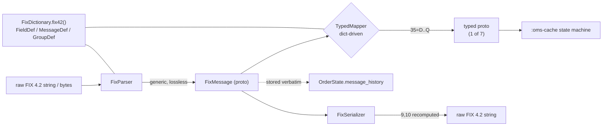

# FIX Parser, Serializer & Embedded 4.2 Data Dictionary

> **Design draft.** This document is part of the design exploration. For the authoritative, reconciled decisions and the corrections applied after review, see [00-overview.md](00-overview.md).


Module: `:fix-codec` — depends on `:fix-proto`. Root package `com.fix42.oms`; codec classes live in `com.fix42.oms.codec`, dictionary in `com.fix42.oms.codec.dict`, mappers in `com.fix42.oms.codec.map`. This document specifies the FIX 4.2 codec: the byte-level `FixParser`, the `FixSerializer`, the embedded FIX 4.2 data dictionary, and the dictionary-driven repeating-group / typed-mapping algorithms.

The codec's job is a **lossless, order-preserving** translation between the FIX 4.2 wire format and the generic `FixMessage` proto, plus a **dictionary-driven** translation between `FixMessage` and the 7 typed message protos in `messages.proto`. All state-machine and cache logic lives above this in `:oms-cache`; the codec has no cache knowledge.

---

## 1. Wire format recap (FIX 4.2)

A FIX message is a flat sequence of `tag=value` fields separated by the **SOH** control byte `0x01` (rendered `|` in this doc). The three structural invariants the codec cares about:

| Concern | Tag | Rule |
|---|---|---|
| Envelope start | `8` BeginString | Always `FIX.4.2`, always first field. |
| Body length | `9` BodyLength | Byte count from the field **after** `9` up to and **including** the SOH before `10`. |
| Checksum | `10` CheckSum | 3-digit, `sum(all bytes up to and including the SOH before tag 10) mod 256`, zero-padded. Always last field. |

Example (SOH shown as `|`, one line):

```
8=FIX.4.2|9=145|35=8|49=SELLSIDE|56=BUYSIDE|34=812|52=20260813-14:22:01.113|37=ORD10001|11=CLIENT-A-1|17=EXEC-9001|20=0|150=0|39=0|55=IBM|54=1|38=1000|151=1000|14=0|6=0|60=20260813-14:22:01.100|10=231|
```

`BeginString(8)`, `BodyLength(9)`, `MsgType(35)` and `CheckSum(10)` are dictionary-agnostic and handled specially; everything else is generic field data until a typed mapper is invoked.

---

## 2. `FixParser`

### 2.1 Contract

```java
public final class FixParser {
    public FixParser(FixDictionary dict, ParserConfig cfg);
    public FixMessage parse(String raw);        // convenience: UTF-8/ASCII bytes
    public FixMessage parse(byte[] raw);        // authoritative: byte-level
}
```

`parse` returns a `com.fix42.oms.proto.FixMessage` — the generic lossless model:

```proto
message FixField   { uint32 tag = 1; string value = 2; }
message FixMessage { repeated FixField fields = 1; } // header+body+trailer, arrival order
```

`ParserConfig` controls validation strictness:

```java
public record ParserConfig(
    boolean strict,            // if true, BodyLength/CheckSum mismatches throw
    boolean validateBodyLength,
    boolean validateChecksum,
    byte soh                   // default 0x01, override only for test fixtures
) {
    public static ParserConfig lenient(); // strict=false, both validations off
    public static ParserConfig strict();  // strict=true, both validations on
}
```

> **Open question:** the ANCHOR says validation is "configurable strict mode." We model that as one `strict` flag that turns *mismatch handling* from warn-and-continue into throw, plus two independent `validate*` switches so a caller can compute-and-ignore. If a single boolean is preferred, collapse to `strict` only. Names are additive, not renames.

### 2.2 Core split algorithm

The naive `split("\u0001")` then `split("=")` is **wrong** for two reasons the ANCHOR calls out: values may contain `=`, and length-prefixed raw-data fields may contain embedded `0x01` and `=`. The parser therefore works on **bytes**, not on a pre-split token list.

Field scan (ignoring raw-data for a moment):

1. Find the next `SOH` from the current cursor. The bytes `[cursor, sohIndex)` are one field.
2. Within that field, find the **first** `=`. Bytes before it are the tag (ASCII digits); bytes after it — up to `sohIndex`, `=` included and beyond — are the value. **Split on the first `=` only**; any further `=` are literal value bytes.
3. Parse tag as `uint32`; append `FixField{tag,value}` preserving order.
4. Advance cursor past `sohIndex`.

This already handles `58=a=b=c` correctly: tag `58`, value `a=b=c`.

### 2.3 Length-prefixed raw-data fields

Some fields carry a byte length in a preceding tag; the data field that follows may contain `0x01` and `=` as legitimate content, so the generic scan above must be **suspended** for exactly *N* bytes.

FIX 4.2 length→data pairs (these are the only ones in 4.2; do **not** invent others):

| Length tag | Data tag | Meaning | Location |
|---|---|---|---|
| `95` RawDataLength | `96` RawData | arbitrary raw data | body |
| `90` SecureDataLen | `91` SecureData | encrypted payload | header |
| `93` SignatureLength | `89` Signature | message signature | trailer |

> Note: `212 XmlDataLen`/`213 XmlData` is **FIX 4.4+**, not 4.2 — the dictionary does not register it. `354 EncodedTextLen`/`355 EncodedText` is **FIX 4.3+** — also excluded.

Algorithm addition — the parser holds a small map `rawDataFollows: dataTag -> lengthValue`:

```
scan loop:
  read one field with the normal "first '=' split" BUT:
  when the just-read tag T is a known LENGTH tag (95/90/93):
      remember N = parseInt(value); mark expectedDataTag = pair(T)   // 95->96, 90->91, 93->89
  else if expectedDataTag is set:
      // we are positioned right after the '=' of the data field's "tag="
      // consume EXACTLY N bytes as the value, ignoring any 0x01 / '=' inside
      value = bytes[valueStart .. valueStart+N)
      require bytes[valueStart+N] == SOH   // field terminator must follow
      append FixField{expectedDataTag, value}; clear expectedDataTag
      advance cursor past that SOH
  else: normal field
```

Key subtlety: when `expectedDataTag` is armed, the parser reads the data field's `tag=` prefix normally (find `=`), then switches to **fixed-length** value consumption for `N` bytes rather than scanning for the next `SOH`. This is what makes embedded SOH/`=` safe. If the byte at offset `valueStart+N` is not `SOH`, that is a length/data mismatch → throw in `strict`, else best-effort resync on the next `SOH`.

ASCII sketch of the state machine:

```
        length tag (95/90/93) seen, remember N
 ┌───────────────┐  ──────────────────────────►  ┌──────────────────────┐
 │  NORMAL scan  │                                │ EXPECT_RAW(dataTag,N)│
 │ split on SOH, │  ◄──── consumed N bytes ────── │ read tag= then take  │
 │ first '=' only│        + trailing SOH          │ exactly N value bytes│
 └───────────────┘                                └──────────────────────┘
```

### 2.4 Validation (BodyLength / CheckSum)

Validation runs **after** the field list is built but reuses the byte buffer:

- **BodyLength(9)**: recompute the byte count from the first byte after the `9=…|` field's SOH through the SOH immediately preceding `10=`. Compare to the parsed `9` value.
- **CheckSum(10)**: `sum of every byte up to and including the SOH before "10="` mod 256, formatted `%03d`. Compare to the parsed `10` value.

Behavior matrix:

| `validateX` | mismatch, `strict=true` | mismatch, `strict=false` |
|---|---|---|
| BodyLength | throw `FixValidationException` | attach warning to result, keep parsing |
| CheckSum | throw `FixValidationException` | attach warning, keep parsing |

Warnings are surfaced via `FixParseResult` when using `parseWithDiagnostics(...)`; the plain `parse(...)` path throws in strict and silently accepts in lenient. The stored `FixMessage` **always** retains the original `9` and `10` fields verbatim (losslessness).

---

## 3. `FixSerializer`

### 3.1 Contract

```java
public final class FixSerializer {
    public FixSerializer(SerializerConfig cfg);
    public String toRaw(FixMessage msg);   // recomputes 9 and 10
    public byte[] toBytes(FixMessage msg);
}
```

`SerializerConfig` chooses whether `9`/`10` are recomputed (default) or emitted verbatim from the proto (diagnostic mode).

### 3.2 Emission algorithm

1. Emit `8=<BeginString>|` first (from the field, or `FIX.4.2` default).
2. Emit `9=<placeholder>` — deferred; body must be built first.
3. Emit **body** = every field except `8`, `9`, `10`, in their stored order, each `tag=value|`. Raw-data length fields (`95/90/93`) are emitted immediately before their data field and their value is **recomputed** to the byte length of the data value (guards against a hand-built proto with a stale length).
4. Compute `BodyLength` = byte count of the body segment (everything after the `9=…|` field up to and including the SOH before `10=`), patch tag `9`.
5. Compute `CheckSum` over all bytes through the SOH before `10=`, emit `10=NNN|`.

### 3.3 Round-trip contract (precise)

Let `P = FixParser`, `S = FixSerializer`, both on well-formed FIX 4.2 input `R`.

> **Round-trip guarantee.** For any well-formed `R`, `S(P(R))` is **byte-identical to `R` except that fields `9` (BodyLength) and `10` (CheckSum) are recomputed**. All other fields — including order, duplicate tags, empty values, and raw-data byte content — are preserved exactly. If `R`'s original `9`/`10` were already correct, then `S(P(R)) == R` byte-for-byte.

Equivalently, over the field list excluding `{9,10}`, `P` and `S` are exact inverses:

```
fields(S(P(R))) \ {9,10}  ==  fields(R) \ {9,10}   (ordered, with duplicates)
```

Losslessness rests on three parser guarantees: (a) order preserved, (b) first-`=`-only split so values keep internal `=`, (c) raw-data captured by exact byte length so embedded SOH survives. The serializer never reorders and never coalesces duplicate tags (FIX allows repeated tags across repeating-group instances).

---

## 4. Embedded FIX 4.2 data dictionary

### 4.1 Why not `FIX42.xml`

QuickFIX-style `FIX42.xml` is ~4,000 lines covering ~140 message types and every field 4.2 ever defined. This project consumes **7** message types from an audit/drop-copy stream. Shipping and parsing the full XML adds a runtime XML dependency, a load-time cost, and a large surface of message types we never dispatch. Instead the dictionary is a **hand-written Java builder** compiled into `:fix-codec`, holding only the 7 in-scope messages plus the header/trailer and the raw-data field defs. It is:

- **Zero-dependency** — no XML parser, no classpath resource I/O on the hot path.
- **Compile-checked** — a typo in a tag is a Java constant, not a silent XML string.
- **Small and auditable** — the whole dictionary is a few hundred lines, reviewable against the FIX 4.2 spec.

Loading: a single `FixDictionary FixDictionary.fix42()` static builder returns an immutable, fully-populated instance (built once, cached). A resource-file loader is intentionally *not* provided; if a deployment needs extra fields, it subclasses/extends the builder in Java.

### 4.2 Java shape

```java
enum FieldType { STRING, CHAR, INT, QTY, PRICE, AMT, UTCTIMESTAMP, BOOLEAN, DATA, LENGTH }

record FieldDef(int tag, String name, FieldType type) {}

// A repeating group: NoXxx count tag, the delimiter (first tag of each entry),
// and the full set of tags that may appear inside one entry.
record GroupDef(int countTag, int delimiterTag, List<Integer> memberTags) {}

// One message type: its 35= code, the flat body field tags it may carry,
// and the repeating groups keyed by their count tag.
record MessageDef(String msgType, List<Integer> fieldTags, Map<Integer, GroupDef> groups) {}

final class FixDictionary {
    FieldDef field(int tag);                 // null if unknown
    MessageDef message(String msgType);      // null if out of scope
    boolean isLengthTag(int tag);            // 95/90/93
    int dataTagFor(int lengthTag);           // 95->96, 90->91, 93->89
    static FixDictionary fix42();            // the embedded instance
}
```

`fieldTags` and `memberTags` are the tags the mapper knows how to project; unknown tags encountered on the wire are still kept in the generic `FixMessage` (lossless) but ignored by typed mapping.

### 4.3 Header / trailer / raw-data fields

Header (subset actually used; all standard 4.2):

| Tag | Name | Type |
|---|---|---|
| 8 | BeginString | STRING |
| 9 | BodyLength | LENGTH |
| 35 | MsgType | STRING |
| 49 | SenderCompID | STRING |
| 56 | TargetCompID | STRING |
| 34 | MsgSeqNum | INT |
| 52 | SendingTime | UTCTIMESTAMP |
| 43 | PossDupFlag | BOOLEAN |
| 122 | OrigSendingTime | UTCTIMESTAMP |
| 90 | SecureDataLen | LENGTH |
| 91 | SecureData | DATA |

Trailer:

| Tag | Name | Type |
|---|---|---|
| 93 | SignatureLength | LENGTH |
| 89 | Signature | DATA |
| 10 | CheckSum | STRING |

Body raw-data pair: `95 RawDataLength (LENGTH)` → `96 RawData (DATA)`.

### 4.4 Concrete dictionary content — the 7 in-scope messages

All tags below are genuine FIX 4.2 tags. Where a tag was renamed in a later version, the 4.2 name is used and flagged.

#### 35=D NewOrderSingle

Body fields: `11 ClOrdID`, `1 Account`, `21 HandlInst`, `55 Symbol`, `54 Side`, `60 TransactTime`, `38 OrderQty`, `40 OrdType`, `44 Price`, `99 StopPx`, `59 TimeInForce`, `15 Currency`, `100 ExDestination`, `58 Text`.

Groups:

| Count tag | Name | Delimiter | Member tags |
|---|---|---|---|
| 78 | NoAllocs | 79 AllocAccount | 79, 80 |

> `80 AllocShares` in FIX 4.2 (renamed `AllocQty` in 4.4+).

#### 35=8 ExecutionReport

Body fields: `37 OrderID`, `11 ClOrdID`, `41 OrigClOrdID`, `17 ExecID`, `20 ExecTransType`, `19 ExecRefID`, `150 ExecType`, `39 OrdStatus`, `103 OrdRejReason`, `1 Account`, `55 Symbol`, `54 Side`, `38 OrderQty`, `40 OrdType`, `44 Price`, `99 StopPx`, `59 TimeInForce`, `15 Currency`, `32 LastShares`, `31 LastPx`, `30 LastMkt`, `151 LeavesQty`, `14 CumQty`, `6 AvgPx`, `60 TransactTime`, `58 Text`.

Groups:

| Count tag | Name | Delimiter | Member tags |
|---|---|---|---|
| 382 | NoContraBrokers | 375 ContraBroker | 375, 337, 437, 438 |

> `32` is `LastShares` in 4.2 (renamed `LastQty` in 4.3+). `20 ExecTransType` and `19 ExecRefID` exist in 4.2 and are **removed** in FIX 5.0 — correct to keep here. Members: `337 ContraTrader`, `437 ContraTradeQty`, `438 ContraTradeTime`.

#### 35=9 OrderCancelReject

Body fields: `37 OrderID`, `11 ClOrdID`, `41 OrigClOrdID`, `39 OrdStatus`, `434 CxlRejResponseTo`, `102 CxlRejReason`, `60 TransactTime`, `58 Text`, `1 Account`.

Groups: none.

> `434 CxlRejResponseTo` is required in the wire message; `102 CxlRejReason` is optional in 4.2. Both map to `OrderState.cxl_rej_reason` / typed fields.

#### 35=F OrderCancelRequest

Body fields: `41 OrigClOrdID`, `11 ClOrdID`, `37 OrderID`, `1 Account`, `55 Symbol`, `54 Side`, `60 TransactTime`, `38 OrderQty`, `58 Text`.

Groups:

| Count tag | Name | Delimiter | Member tags |
|---|---|---|---|
| 78 | NoAllocs | 79 AllocAccount | 79, 80 |

> In 4.2, cancel quantity is carried in `38 OrderQty` (the older `84 CxlQty` from 4.0/4.1 is gone). Do not use `84`.

#### 35=G OrderCancelReplaceRequest

Body fields: `37 OrderID`, `41 OrigClOrdID`, `11 ClOrdID`, `1 Account`, `21 HandlInst`, `55 Symbol`, `54 Side`, `60 TransactTime`, `38 OrderQty`, `40 OrdType`, `44 Price`, `99 StopPx`, `59 TimeInForce`, `15 Currency`, `100 ExDestination`, `58 Text`.

Groups:

| Count tag | Name | Delimiter | Member tags |
|---|---|---|---|
| 78 | NoAllocs | 79 AllocAccount | 79, 80 |

#### 35=H OrderStatusRequest

Body fields: `37 OrderID`, `11 ClOrdID`, `1 Account`, `55 Symbol`, `54 Side`.

Groups: none. (FIX 4.2 `H` is a thin request; `54 Side` is required, `55 Symbol` required.)

#### 35=Q DontKnowTrade (DK)

Body fields: `37 OrderID`, `17 ExecID`, `127 DKReason`, `55 Symbol`, `54 Side`, `38 OrderQty`, `32 LastShares`, `31 LastPx`.

Groups: none.

> `127 DKReason` is the 4.2 DK reason code (A=unknown symbol, B=wrong side, C=quantity mismatch, D=no matching order, E=price mismatch, F=calc mismatch).

### 4.5 Group parent-tag note

The parent tag ordering matters: in FIX, the `NoAllocs(78)` count and its entries appear at a fixed logical position, but the parser does **not** rely on position — it relies on the count tag appearing, then `delimiterTag` starting each entry (see §5). The dictionary's `parent link` tag `526 SecondaryClOrdID` used by `ParentLinkResolver` in `:oms-cache` is **not** a codec concern; the codec merely preserves tag `526` verbatim in the generic `FixMessage`, and the resolver reads it downstream.

---

## 5. Repeating-group parsing algorithm

The generic `FixParser` (§2) does **not** understand groups — it produces a flat ordered `FixField` list, which is correct and lossless. Group structure is recovered by the **typed mapper** using `GroupDef`, at the moment it projects a `FixMessage` into a typed proto.

### 5.1 Delimiter-driven entry splitting

Given the flat field list and a `GroupDef{countTag, delimiterTag, memberTags}`:

```
findGroup(fields, groupDef):
  i = index of countTag in fields
  if none -> group absent, return []
  expectedCount = int(fields[i].value)
  entries = []
  j = i + 1
  current = null
  while j < fields.size:
      tag = fields[j].tag
      if tag == delimiterTag:
          if current != null: entries.add(current)
          current = new Entry(); current.put(tag, value)
      else if tag in groupDef.memberTags and current != null:
          current.put(tag, value)          // still inside this entry
      else:
          break                            // first non-member tag ends the group
      j++
  if current != null: entries.add(current)
  assert entries.size == expectedCount   // strict: throw on mismatch
  return entries
```

Rules that make this robust:

- **The delimiter tag opens each entry.** A second occurrence of the delimiter tag starts the next entry. This is the FIX-standard way to bound variable-length entries.
- **A tag not in `memberTags` terminates the group** (we've fallen through to the next flat body field or trailer).
- **Count is validated** against the number of entries recovered; mismatch throws in strict mode, warns otherwise.
- Nested groups are not present in any of the 7 in-scope messages, so the algorithm is single-level. (If ever needed, `GroupDef.memberTags` would reference a nested count tag and the routine recurses.)

### 5.2 How the typed mapper uses `GroupDef`

```java
public interface TypedMapper<T extends Message> {
    T fromFix(FixMessage msg);   // generic -> typed
    FixMessage toFix(T typed);   // typed -> generic (round-trippable)
}
```

`fromFix` for ExecutionReport:

1. Look up `MessageDef` by `35=8`.
2. For each flat `fieldTag`, read the last (or first — see below) occurrence and set the scalar proto field via the tag→field binding.
3. For each `GroupDef` (here `382`), run `findGroup`, build one repeated sub-message per entry (`ContraBroker` repeating group in the typed `ExecutionReport`).
4. Preserve unmapped tags nowhere in the typed proto — but the **generic** `FixMessage` is what `OrderState.message_history` stores, so nothing is lost at the cache layer.

`toFix` reverses it: emit header, scalars in dictionary field order, then for each group emit the count tag followed by entries with the delimiter tag first. Because `FixSerializer` recomputes `9`/`10`, the resulting raw string round-trips.

> Scalar duplicate-tag policy: for the 7 in-scope messages no scalar body tag legitimately repeats outside a group, so the mapper reads the **first** occurrence of a scalar tag and treats a repeat as a warning in strict mode.

---

## 6. Worked example: ExecutionReport (partial fill)

### 6.1 Raw wire string (SOH = `|`)

```
8=FIX.4.2|9=207|35=8|49=SELLSIDE|56=BUYSIDE|34=813|52=20260813-14:22:05.001|37=ORD10001|11=CLIENT-A-1|17=EXEC-9002|20=0|150=1|39=1|55=IBM|54=1|38=1000|32=400|31=142.15|30=XNYS|151=600|14=400|6=142.15|60=20260813-14:22:05.000|382=2|375=BRKA|337=TRD1|437=250|438=20260813-14:22:04.900|375=BRKB|337=TRD2|437=150|438=20260813-14:22:04.950|58=partial|10=017|
```

### 6.2 Step 1 — `FixParser.parse` → `FixMessage` (generic, ordered)

The parser emits `FixField`s in exact arrival order. Abridged:

```
FixMessage {
  {8,  "FIX.4.2"} {9, "207"} {35, "8"} {49,"SELLSIDE"} {56,"BUYSIDE"}
  {34,"813"} {52,"20260813-14:22:05.001"}
  {37,"ORD10001"} {11,"CLIENT-A-1"} {17,"EXEC-9002"} {20,"0"} {150,"1"} {39,"1"}
  {55,"IBM"} {54,"1"} {38,"1000"} {32,"400"} {31,"142.15"} {30,"XNYS"}
  {151,"600"} {14,"400"} {6,"142.15"} {60,"20260813-14:22:05.000"}
  {382,"2"}
    {375,"BRKA"} {337,"TRD1"} {437,"250"} {438,"20260813-14:22:04.900"}
    {375,"BRKB"} {337,"TRD2"} {437,"150"} {438,"20260813-14:22:04.950"}
  {58,"partial"} {10,"017"}
}
```

No raw-data field here; had `95=6|96=a|b=c|` appeared, the parser would have consumed exactly 6 value bytes (`a|b=c…`) for tag 96 regardless of the internal `|` and `=`.

### 6.3 Step 2 — validation

- `BodyLength`: recompute byte count from the byte after `9=207|` through the SOH before `10=` → must equal 207 (illustrative; real value computed from the exact bytes). Mismatch → throw in strict.
- `CheckSum`: sum of bytes through the SOH before `10=`, mod 256, `%03d` → must equal `017`.

### 6.4 Step 3 — `TypedMapper<ExecutionReport>.fromFix`

Scalars bind by dictionary tag → proto field (proto3 snake_case in parentheses):

| Tag | Value | Typed `ExecutionReport` field |
|---|---|---|
| 37 | ORD10001 | order_id |
| 11 | CLIENT-A-1 | cl_ord_id |
| 17 | EXEC-9002 | exec_id |
| 20 | 0 | exec_trans_type = NEW |
| 150 | 1 | exec_type = PARTIAL_FILL |
| 39 | 1 | ord_status = PARTIALLY_FILLED |
| 55 | IBM | symbol |
| 54 | 1 | side = BUY |
| 38 | 1000 | order_qty |
| 32 | 400 | last_qty *(tag 32 LastShares)* |
| 31 | 142.15 | last_px |
| 30 | XNYS | last_market |
| 151 | 600 | leaves_qty |
| 14 | 400 | cum_qty |
| 6 | 142.15 | avg_px |
| 60 | … | transact_time |
| 58 | partial | text |

Enum mapping is **semantic**, not the FIX char: the mapper translates FIX code `150=1` → proto enum `ExecType.PARTIAL_FILL` (whatever its numeric value in `order_state.proto`), consistent with the ANCHOR's rule that "enum numeric values are semantic, NOT the FIX char codes."

Group `382=2` via `findGroup(fields, GroupDef{382,375,[375,337,437,438]})` yields two entries → two repeated `ContraBroker` sub-messages:

```
contra_brokers: [
  { contra_broker:"BRKA", contra_trader:"TRD1", contra_trade_qty:250,
    contra_trade_time:"20260813-14:22:04.900" },
  { contra_broker:"BRKB", contra_trader:"TRD2", contra_trade_qty:150,
    contra_trade_time:"20260813-14:22:04.950" }
]
```

The count `2` equals the recovered entry count → OK. The first non-member tag after the group (`58`) terminates it.

### 6.5 Step 4 — round-trip check

`FixSerializer.toRaw(FixParser.parse(R))` reproduces `R` byte-for-byte except that `9` and `10` are recomputed; since the sample's `9`/`10` were correct, output equals input. The `ExecutionReport` typed proto then flows to `:oms-cache`, where the ANCHOR state machine updates `OrderState` (`cum_qty`, `leaves_qty`, `avg_px`, `last_exec_type`, `ord_status`, appends `exec_ids`, appends the generic `FixMessage` to `message_history`).

---

## 7. Data flow summary



- `FixParser` and `FixSerializer` are pure codec, dictionary-aware only for raw-data length tags and (parser) nothing else structural.
- The `FixDictionary` (hand-written Java builder, embedded, immutable) supplies `FieldDef`/`MessageDef`/`GroupDef` to the typed mappers and the raw-data pairing to the parser.
- The generic `FixMessage` is the **lossless** currency between codec and cache; typed protos are the **convenient projection** for the state machine. Both are retained (typed drives updates, generic is archived in `message_history`).

---

## 8. Correctness checklist (FIX 4.2 specifics)

- Split each field on the **first** `=` only — values keep internal `=` (e.g. `58=a=b`).
- Length-prefixed data (`95→96`, `90→91`, `93→89`) consumed by **exact byte length**, immune to embedded SOH/`=`. No other 4.2 length/data pairs exist; `212/213` and `354/355` are later versions and excluded.
- `32` is **LastShares** in 4.2 (proto field `last_qty`); `20 ExecTransType` and `19 ExecRefID` are valid 4.2 (removed in FIX 5.0); `434 CxlRejResponseTo`, `102 CxlRejReason`, `127 DKReason`, `526 SecondaryClOrdID` are all valid 4.2.
- Repeating groups recovered by **delimiter tag**, count validated: `NoAllocs 78`/delim `79`/(79,80); `NoContraBrokers 382`/delim `375`/(375,337,437,438).
- `BodyLength(9)`/`CheckSum(10)` recomputed on serialize; validated on parse per `ParserConfig`; original values preserved in the proto.
- Round-trip: `S(P(R)) == R` modulo recomputed `9`/`10`; exact when input `9`/`10` were already correct.
