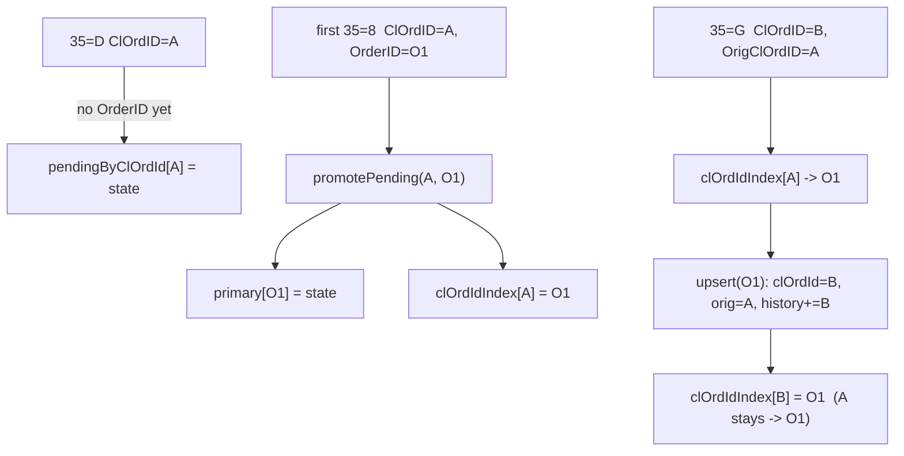
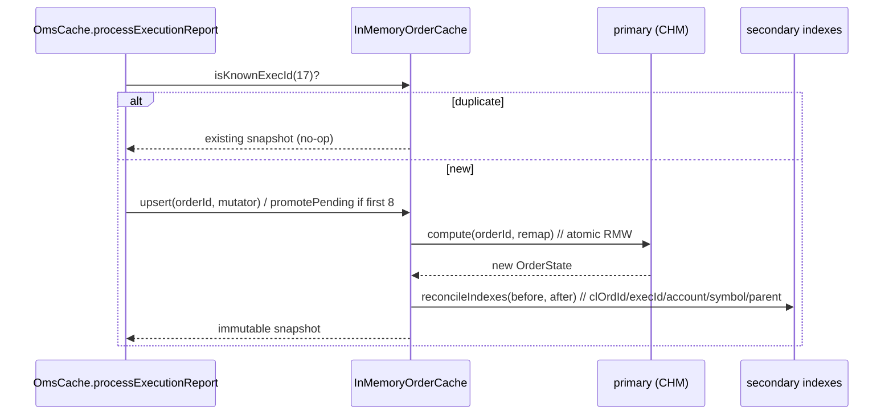

# Cache Design, Indexes & Concurrency

> **Design draft.** This document is part of the design exploration. For the authoritative, reconciled decisions and the corrections applied after review, see [00-overview.md](00-overview.md).


> Module: `:oms-cache` · Package root: `com.fix42.oms` · Java 23 · protobuf-java 4.35.1
> Depends on `:fix-codec`, `:fix-proto`. Runtime dependency: **protobuf-java only** (Caffeine optional).

This document specifies the storage layer of `:oms-cache`: the `OrderCache` abstraction, its
default `InMemoryOrderCache` implementation, the exact secondary index set, the per-order
concurrency model, and the memory/lifecycle policy for the unbounded `message_history`.

---

## 1. Build-from-scratch vs a third-party cache

The TODO explicitly asks: *"3rd-party cache lib vs build from scratch?"* The answer is **build a
thin in-memory cache** keyed on `ConcurrentHashMap`, and treat Caffeine as an optional, documented
add-on for TTL eviction only.

### 1.1 Why not Redis / Hazelcast / Ehcache?

| Candidate | What it buys | Why it is wrong here |
|-----------|--------------|----------------------|
| **Redis** | Distributed KV, persistence, pub/sub | Out-of-process → network hop + serialization on **every** read-modify-write of an `OrderState`. Our workload is a hot, single-JVM, per-order read-modify-write against a live FIX stream. A network round-trip per `35=8` defeats the purpose. Adds an operational dependency (a server) the anchor forbids. |
| **Hazelcast** | In-memory data grid, clustering | Solves distribution/HA we do not need; brings a large dependency tree and its own threading/serialization model. The cache is a library embedded in a consumer, not a cluster. |
| **Ehcache** | Heap/off-heap tiering, JSR-107 | Its value proposition is tiered/overflow storage. Our value (`OrderState`) is small and hot; we want raw `ConcurrentHashMap` semantics (atomic `compute`) which Ehcache abstracts away. |
| **Caffeine** | High-perf on-heap cache, **TTL/size eviction** | Genuinely useful, but *only* for one sub-problem: evicting **terminal** orders after a TTL. It is not a general store for us because we need multiple secondary indexes and atomic multi-index updates that Caffeine does not coordinate. Kept **optional**. |

### 1.2 Why a hand-rolled `ConcurrentHashMap` cache wins

1. **Zero runtime dependency** beyond protobuf-java → deterministic builds, no version drift, no
   server to run in tests. The anchor mandates this.
2. **Atomic read-modify-write per key.** `ConcurrentHashMap.compute(k, remapping)` executes the
   remapping function **atomically for that key** (holding the bin lock). This is exactly the
   primitive an order state machine needs: read current `OrderState`, apply one FIX message, write
   the new state — with no interleaving on that order.
3. **Speed & predictability.** On-heap object references, no serialization on the hot path,
   nanosecond map access, no GC-hostile off-heap juggling.
4. **We own the multi-index invariant.** A FIX message updates the primary map *and* several
   secondary indexes; those must move together. A general cache library cannot express
   "update these 4 maps as one logical unit for this order" — we can, under our own critical section.

> **Decision:** `InMemoryOrderCache` backed by `ConcurrentHashMap` for the primary store and every
> secondary index. Caffeine is an *optional* eviction driver plugged in behind the same
> `OrderCache` interface (§6.3), never a required dependency.

---

## 2. The `OrderCache` interface

The cache stores the protobuf `OrderState` (the canonical cache value from the anchor) and owns all
indexes. State-machine logic lives above it (in the process\* methods of `OmsCache`); the cache is
responsible for **storage + indexing + atomicity**, not for interpreting FIX semantics.

```java
package com.fix42.oms.cache;

import com.fix42.oms.proto.OrderState;
import java.util.List;
import java.util.Optional;
import java.util.Set;
import java.util.function.UnaryOperator;

/**
 * Storage + indexing contract for order state. Thread-safe. All mutating calls
 * are atomic per orderId (see §4). Reads return immutable protobuf snapshots.
 */
public interface OrderCache {

    /* ---- primary, orderId-keyed access ---- */

    /** Atomic read-modify-write of the OrderState for {@code orderId}.
     *  {@code mutator} receives the current state (a fresh builder seed) and returns
     *  the new state; it runs under the per-order critical section and MUST be pure
     *  (no side effects, no escaping the OrderState). Secondary indexes are
     *  reconciled from the before/after diff inside the same section. Returns the
     *  new immutable state. Creates the entry if absent (mutator sees a default). */
    OrderState upsert(String orderId, UnaryOperator<OrderState> mutator);

    Optional<OrderState> getByOrderId(String orderId);      // immutable snapshot

    /* ---- pre-OrderID (ClOrdID-only) lifecycle ---- */

    /** Create/mutate an order that has NO OrderID yet (e.g. a 35=D before its first 35=8).
     *  Keyed in pendingByClOrdId. */
    OrderState upsertPending(String clOrdId, UnaryOperator<OrderState> mutator);

    /** When the first 35=8 assigns OrderID (37), migrate the pending state to the
     *  primary map and repoint every index. Atomic. See §5.2. */
    OrderState promotePending(String clOrdId, String orderId, UnaryOperator<OrderState> mutator);

    /* ---- secondary lookups (all return snapshots / id sets) ---- */

    Optional<OrderState> getByClOrdId(String clOrdId);      // via clOrdIdIndex → primary
    Optional<OrderState> getByExecId(String execId);        // via execIdIndex → primary
    List<OrderState>     findByAccount(String account);     // via accountIndex
    List<OrderState>     findBySymbol(String symbol);       // via symbolIndex
    Set<String>          getChildOrderIds(String parentOrderId);   // via parentIndex

    /** True if this ExecID (17) was already applied — duplicate/replay suppression (§6.4). */
    boolean isKnownExecId(String execId);

    int size();
}
```

Notes on the shape:

- `upsert` takes a `UnaryOperator<OrderState>` rather than a plain value so the caller cannot do a
  racy `get`-then-`put`. The cache, not the caller, controls the critical section.
- Every read returns an **immutable protobuf message** (protobuf-java generated messages are
  effectively immutable once `build()`), so a snapshot cannot be mutated to corrupt the store (§4.4).
- The interface never exposes the raw maps; index maintenance is an internal invariant.

---

## 3. The index set (canonical)

All seven structures are from the PROJECT ANCHOR and must keep these exact names. All are concurrent.

| Index | Type | Key | Value | Written when | Read when |
|-------|------|-----|-------|--------------|-----------|
| **primary** | `ConcurrentHashMap<String,OrderState>` | `orderId` (37) | `OrderState` | first `35=8` assigns OrderID; every subsequent update | `getByOrderId`; resolve target of every secondary index |
| **pendingByClOrdId** | `ConcurrentHashMap<String,OrderState>` | `clOrdId` (11) | `OrderState` (no OrderID yet) | `35=D`/`35=F`/`35=G` seen before any OrderID | resolve a ClOrdID that has no OrderID; migrated out on promotion |
| **clOrdIdIndex** | `ConcurrentHashMap<String,String>` | `clOrdId` (11) | `orderId` (37) | every ClOrdID in the chain, incl. `OrigClOrdID` (41) links, once an OrderID exists | `getByClOrdId`; chain resolution on `35=F`/`35=G` |
| **execIdIndex** | `ConcurrentHashMap<String,String>` | `execId` (17) | `orderId` (37) | every `35=8` | `getByExecId`; **duplicate suppression** (§6.4) |
| **accountIndex** | `ConcurrentHashMap<String,Set<String>>` | `account` (1) | `Set<orderId>` | first time an order's account is known | `findByAccount` |
| **symbolIndex** | `ConcurrentHashMap<String,Set<String>>` | `symbol` (55) | `Set<orderId>` | first time an order's symbol is known | `findBySymbol` |
| **parentIndex** | `ConcurrentHashMap<String,Set<String>>` | `parentOrderId` | `Set<childOrderId>` | when `ParentLinkResolver` resolves a parent link (default tag 526, §3.2) | `getChildOrderIds`, `getParent` |

For the `Set<String>` values use `ConcurrentHashMap.newKeySet()` (a concurrent set) so add/iterate
are safe without locking the whole index.

```java
// field declarations in InMemoryOrderCache
private final ConcurrentHashMap<String, OrderState> primary          = new ConcurrentHashMap<>();
private final ConcurrentHashMap<String, OrderState> pendingByClOrdId = new ConcurrentHashMap<>();
private final ConcurrentHashMap<String, String>     clOrdIdIndex     = new ConcurrentHashMap<>();
private final ConcurrentHashMap<String, String>     execIdIndex      = new ConcurrentHashMap<>();
private final ConcurrentHashMap<String, Set<String>> accountIndex    = new ConcurrentHashMap<>();
private final ConcurrentHashMap<String, Set<String>> symbolIndex     = new ConcurrentHashMap<>();
private final ConcurrentHashMap<String, Set<String>> parentIndex     = new ConcurrentHashMap<>();
```

### 3.1 FIX tag reference used by the indexes

| Tag | Name | Role in indexing |
|-----|------|------------------|
| 37 | OrderID | primary key; assigned by sell-side, stable across a chain, first seen on first `35=8` |
| 11 | ClOrdID | new value per `35=D`/`35=F`/`35=G`; keys `pendingByClOrdId` and `clOrdIdIndex` |
| 41 | OrigClOrdID | on `35=F`/`35=G`, points at the prior ClOrdID → chain link |
| 17 | ExecID | unique per `35=8`; keys `execIdIndex`; duplicate detection |
| 19 | ExecRefID | on trade cancel/correct, references the ExecID being amended |
| 20 | ExecTransType | New(0)/Cancel(1)/Correct(2)/Status(3) — qualifies how a `35=8` mutates fills |
| 150 | ExecType | drives state (with 39) |
| 39 | OrdStatus | order status |
| 1 | Account | `accountIndex` |
| 55 | Symbol | `symbolIndex` |

> **FIX-version note (ExecType/OrdStatus):** In FIX 4.2 `ExecType` (150) carries the *now-legacy*
> values where partial fills and fills are distinct (`1`=Partial fill, `2`=Fill). FIX 4.3+ merged
> these into `Trade (F)` and moved cumulative semantics onto `LeavesQty` (151). The `:fix-codec`
> dictionary must map the 4.2 char codes; the cache stores the semantic proto enum
> (`ExecType`/`OrdStatus`), **not** the raw char.

### 3.2 parentIndex and the parent link tag

FIX 4.2 has **no standard parent-order tag**. Per the anchor, parent linkage goes through a
pluggable `ParentLinkResolver`; the default reads a configurable tag, default **526
SecondaryClOrdID**.

> **Open question:** Tag **526 (SecondaryClOrdID) was introduced in FIX 4.3**, not 4.2. On a strict
> 4.2 wire it is a user-defined/custom tag. We keep the anchor's default of 526 (it is the most
> natural forward-compatible choice and is overridable per deployment), but deployments on pure 4.2
> feeds should confirm their venue actually populates 526, or configure the resolver to a
> venue-specific custom tag (5000–9999 user range). This is a configuration decision, documented
> here, not a silent assumption.

---

## 4. Concurrency: per-order atomicity

### 4.1 Why naive get-then-put races

The state machine does a read-modify-write: take the current `OrderState`, apply one FIX message,
store the result. A naive implementation:

```java
// WRONG — lost update
OrderState cur = primary.get(orderId);            // T1 and T2 both read cumQty=100
OrderState next = applyFill(cur, fillOf50);       // T1 → 150 ; T2 → 150 (should be 200)
primary.put(orderId, next);                        // last writer wins → one 50-fill lost
```

Two `35=8` fills for the same order arriving on different threads can interleave between the `get`
and the `put`; one fill is silently dropped, `cum_qty`/`leaves_qty`/`avg_px` end up wrong, and the
`message_history`/`exec_ids` may lose an entry. This is a classic lost-update.

### 4.2 The fix: atomic `compute` on the primary map

`ConcurrentHashMap.compute(key, remappingFn)` runs the remapping function **atomically with respect
to that key** — the bin is locked for the duration, so no other `compute`/`put`/`remove` on the same
key interleaves. That is the whole read-modify-write done atomically:

```java
@Override
public OrderState upsert(String orderId, UnaryOperator<OrderState> mutator) {
    final OrderState[] before = new OrderState[1];
    OrderState after = primary.compute(orderId, (k, cur) -> {
        OrderState seed = (cur != null) ? cur : OrderState.newBuilder()
                .setOrderId(k)
                .setFirstSeenEpochMillis(now())
                .build();
        before[0] = cur;                       // may be null
        OrderState next = mutator.apply(seed); // pure state-machine step
        return withTimestamps(next);           // stamp last_update_epoch_millis
    });
    reconcileIndexes(before[0], after);        // §4.3 — inside no lock, but idempotent & CAS-based
    return after;
}
```

Two subtleties:

- **`compute` remapping must be side-effect-free and fast.** Keep the mutator pure (build a new
  `OrderState`). Do **not** perform I/O, block, or call back into the cache from inside it — that
  can deadlock the bin lock or stall other writers on the same key. The anchor's state machine is
  pure arithmetic + enum transitions, which is ideal.
- **Secondary-index reconciliation** (§4.3) happens after the atomic block using the `before`/`after`
  diff. Those index maps are themselves concurrent and updated with idempotent, CAS-style ops, so
  the brief window between the primary write and the index write is tolerable for reads (a
  by-account lookup might momentarily miss a brand-new order); see §4.5 for the stricter option.

### 4.3 Secondary index consistency

Every index write is derived from the `(before, after)` pair so it is **idempotent** — re-running it
produces the same index state:

```java
private void reconcileIndexes(OrderState before, OrderState after) {
    String orderId = after.getOrderId();

    // clOrdIdIndex: current ClOrdID + full history + OrigClOrdID chain links
    indexClOrdId(after.getClOrdId(), orderId);
    for (String c : after.getClOrdIdHistoryList()) indexClOrdId(c, orderId);
    if (!after.getOrigClOrdId().isEmpty()) indexClOrdId(after.getOrigClOrdId(), orderId);

    // execIdIndex: every ExecID seen on this order
    for (String e : after.getExecIdsList()) execIdIndex.putIfAbsent(e, orderId);

    // accountIndex / symbolIndex: add-only membership
    if (!after.getAccount().isEmpty())
        accountIndex.computeIfAbsent(after.getAccount(), k -> ConcurrentHashMap.newKeySet()).add(orderId);
    if (!after.getSymbol().isEmpty())
        symbolIndex.computeIfAbsent(after.getSymbol(), k -> ConcurrentHashMap.newKeySet()).add(orderId);

    // parentIndex: if this order has a resolved parent, register it as a child
    if (!after.getParentOrderId().isEmpty())
        parentIndex.computeIfAbsent(after.getParentOrderId(), k -> ConcurrentHashMap.newKeySet()).add(orderId);
}

private void indexClOrdId(String clOrdId, String orderId) {
    if (clOrdId == null || clOrdId.isEmpty()) return;
    clOrdIdIndex.put(clOrdId, orderId);   // last-writer-wins is correct: a ClOrdID maps to one OrderID
}
```

Because the maps are add-only (or last-writer-wins with a stable value), no cross-index lock is
required for correctness of a single order. The one operation that genuinely spans maps and must be
atomic as a unit is the **pending → primary promotion**, handled in §5.2 with a per-key lock.

### 4.4 Snapshot reads return immutable copies

Reads never hand out a live builder or a reference that could be mutated:

```java
@Override
public Optional<OrderState> getByOrderId(String orderId) {
    return Optional.ofNullable(primary.get(orderId));  // OrderState is immutable once built
}
```

protobuf-java generated messages are immutable after `build()`; there are no setters on the message.
So returning the stored reference is already a safe snapshot — the caller can `.toBuilder()` to copy
but cannot alter the cached instance. Every `upsert` replaces the map value with a **new** immutable
instance, so a reader holding an old reference simply sees a consistent older snapshot (no torn read).

### 4.5 Per-order lock / striping (when `compute` is not enough)

`compute` guarantees atomicity of the **primary** write. When a single logical transition must touch
the primary map *and* move entries between maps atomically (promotion, chain re-pointing), use an
explicit per-order lock so readers of the secondary indexes never observe a half-migrated order:

```java
// Striped locks: bounded lock count, hashed by the stable key (orderId, else clOrdId).
private final Object[] stripes = new Object[256];
{ for (int i = 0; i < stripes.length; i++) stripes[i] = new Object(); }
private Object lockFor(String key) { return stripes[(key.hashCode() & 0x7fffffff) % stripes.length]; }
```

- **Single-writer-per-order** is the mental model: all mutations for one `orderId` serialize, either
  via `compute`'s bin lock (fast path) or the stripe lock (multi-map path). Reads stay lock-free.
- Striping bounds memory (256 monitors) versus a per-order lock map that would itself need eviction.
- Choose the stripe by the **stable** identifier. Before promotion that is the `clOrdId`; after
  promotion it is the `orderId`. Promotion (§5.2) takes **both** stripes (ordered by identity hash to
  avoid deadlock) so the pre- and post-OrderID identities are covered.

```
   35=8 (fill 50)          35=8 (fill 50)
        │                       │
   thread A                thread B
        └──── compute(orderId) ─┘     ← bin lock serializes; cum_qty 100→150→200 ✓
                 primary map           (naive get/put would have produced 150)
```

---

## 5. Lifecycle: pending → primary migration

### 5.1 The problem

A `35=D` (NewOrderSingle) and even a `35=F`/`35=G` can arrive **before** any `35=8`, so no OrderID
(37) exists yet. We must still cache the order, keyed by ClOrdID, then reconcile when the first
`35=8` assigns the OrderID.

### 5.2 The migration (canonical maintenance rule)

> When the first `35=8` assigns OrderID (37): migrate the `OrderState` from **pendingByClOrdId** to
> **primary**, and repoint **clOrdIdIndex** (every ClOrdID in the chain → the new OrderID).

```java
@Override
public OrderState promotePending(String clOrdId, String orderId, UnaryOperator<OrderState> mutator) {
    Object a = lockFor(clOrdId), b = lockFor(orderId);
    Object first = System.identityHashCode(a) <= System.identityHashCode(b) ? a : b;
    Object second = (first == a) ? b : a;
    synchronized (first) { synchronized (second) {

        OrderState pending = pendingByClOrdId.get(clOrdId);          // may be null (35=8 first)
        OrderState seed = (pending != null) ? pending
                        : primary.getOrDefault(orderId,
                            OrderState.newBuilder().setClOrdId(clOrdId)
                                      .setFirstSeenEpochMillis(now()).build());

        OrderState next = withTimestamps(
            mutator.apply(seed.toBuilder().setOrderId(orderId).build()));

        primary.put(orderId, next);              // now keyed by OrderID
        pendingByClOrdId.remove(clOrdId);        // leave the pending map

        // Repoint clOrdIdIndex: current ClOrdID, full history, and any OrigClOrdID links.
        clOrdIdIndex.put(clOrdId, orderId);
        clOrdIdIndex.put(next.getClOrdId(), orderId);
        for (String c : next.getClOrdIdHistoryList()) clOrdIdIndex.put(c, orderId);
        if (!next.getOrigClOrdId().isEmpty()) clOrdIdIndex.put(next.getOrigClOrdId(), orderId);

        reconcileIndexes(pending, next);         // account/symbol/exec/parent
        return next;
    }}
}
```

Chain resolution flow (`35=F`/`35=G` cancel/replace before vs after OrderID):



Key invariant: **a ClOrdID never moves off an OrderID once assigned.** `35=G` introduces a *new*
ClOrdID (B) and references the old one (A) via OrigClOrdID (41); both A and B resolve to the same
OrderID O1. `cl_ord_id` holds the current (B), `orig_cl_ord_id` holds the latest prior (A), and
`cl_ord_id_history` accumulates the chain.

---

## 6. Memory & lifecycle policy

### 6.1 `message_history` is unbounded

`OrderState.message_history` (repeated `FixMessage`) stores **every** parsed message joined per
`order_id`, in arrival order. For a long-lived, heavily amended parent order this grows without
bound. We offer two configurable controls (defaults chosen for correctness over footprint):

```java
public record CacheConfig(
    int  maxHistoryPerOrder,          // 0 = unbounded (default). >0 = ring-cap, oldest dropped
    boolean evictTerminalOrders,      // default false
    Duration terminalTtl,             // e.g. Duration.ofMinutes(15); used only if eviction on
    boolean dropHistoryOnTerminal     // default false: keep last state, discard message_history
) {}
```

- **`maxHistoryPerOrder` (ring cap):** when set, keep only the most recent *N* `FixMessage`s per
  order (a bounded deque). The **latest-state fields stay exact** — they are folded forward as each
  message is applied — only the raw audit tail is trimmed. Document this as "state is exact, history
  is windowed."
- **`dropHistoryOnTerminal`:** once an order reaches a terminal `OrdStatus` (Filled `2`, Canceled
  `4`, Rejected `8`, Expired `C`, DoneForDay `3`), optionally discard `message_history` while
  retaining the final `OrderState` for lookups.

### 6.2 Store parsed `FixMessage`, not the raw string

We store the **parsed** generic `FixMessage` (the lossless, ordered tag/value wire model from
`fix.proto`), not the raw FIX string:

- `FixMessage` is lossless — it preserves header, body, trailer, and field order — so
  `FixSerializer` can reconstruct the exact raw string on demand. Storing the string too would
  double the memory for zero information gain.
- One representation avoids the raw/parsed drift problem and keeps `message_history` uniform for
  the codec round-trip tests.

> Trade-off: reconstructing the raw string costs a serialize pass. If a deployment needs the raw
> bytes on a hot path (e.g. verbatim re-publish), add an *optional* `raw_fix` string alongside; it
> is off by default to honor the memory policy.

### 6.3 Optional Caffeine TTL eviction — same interface

Caffeine plugs in **behind `OrderCache`** without changing the interface. It drives TTL eviction of
**terminal** orders only; the primary/index maps remain our `ConcurrentHashMap`s, and Caffeine is
used as a *tracker of eviction candidates*, so index removal stays under our control.

```java
// Optional module, only compiled when the caffeine feature is on the classpath.
final class CaffeineTtlEvictor {
    private final Cache<String, Boolean> terminal = Caffeine.newBuilder()
        .expireAfterWrite(config.terminalTtl())
        .removalListener((String orderId, Boolean v, RemovalCause cause) -> {
            if (cause.wasEvicted()) cache.evict(orderId);   // remove from primary + all indexes
        })
        .build();

    void markTerminal(String orderId) { terminal.put(orderId, Boolean.TRUE); }
}
```

- When the state machine transitions an order to terminal, `OmsCache` calls `markTerminal`.
- After `terminalTtl`, Caffeine's removal listener calls `cache.evict(orderId)`, which removes the
  entry from **primary** and prunes it from every secondary index (`clOrdIdIndex`, `execIdIndex`,
  the account/symbol/parent sets).
- If Caffeine is absent, `evictTerminalOrders=false` and orders live forever (bounded only by the
  history cap). **No behavioral change to the `OrderCache` contract either way.**

```java
void evict(String orderId) {
    OrderState s = primary.remove(orderId);
    if (s == null) return;
    for (String c : s.getClOrdIdHistoryList()) clOrdIdIndex.remove(c, orderId);
    clOrdIdIndex.remove(s.getClOrdId(), orderId);
    for (String e : s.getExecIdsList()) execIdIndex.remove(e, orderId);
    removeFromSet(accountIndex, s.getAccount(), orderId);
    removeFromSet(symbolIndex,  s.getSymbol(),  orderId);
    removeFromSet(parentIndex,  s.getParentOrderId(), orderId);
}
```

(`ConcurrentHashMap.remove(k, v)` removes only if the mapping still points at this order — safe
against a concurrent chain re-point.)

### 6.4 Duplicate / replay suppression via `execIdIndex`

Drop-copy and audit-trail feeds replay. ExecID (17) is unique per `35=8`, so `execIdIndex` doubles
as a **dedup filter**:

```java
// in processExecutionReport, before applying:
if (cache.isKnownExecId(execReport.getExecId())) {
    return cache.getByExecId(execReport.getExecId()).orElseThrow();  // idempotent no-op
}
```

Because `execIdIndex.putIfAbsent(execId, orderId)` is done inside `reconcileIndexes`, a replayed
`35=8` with an already-seen ExecID is recognized and skipped, so `cum_qty`/`avg_px` are never
double-counted. Trade cancel/correct (`ExecTransType` 1/2 with `ExecRefID` 19) are **not**
duplicates — they carry a *new* ExecID and reference the prior one via ExecRefID, so they pass the
filter and are applied as corrections.

---

## 7. End-to-end write path (one `35=8`)



## 8. Concurrency guarantees (to document publicly)

- **Per-order linearizability of writes.** All mutations to one `orderId` (or its pre-OrderID
  `clOrdId`) serialize via `compute`'s bin lock and/or a stripe lock. No lost updates.
- **Lock-free reads.** `getByOrderId`/`getByClOrdId`/`getByExecId`/`findBy*` never block writers and
  return an internally consistent immutable snapshot (protobuf message).
- **Index eventual consistency window.** Between the atomic primary write and secondary-index
  reconcile there is a sub-microsecond window where a `findByAccount` may not yet list a brand-new
  order. Membership indexes are add-only and idempotent, so they converge; use the stripe-locked
  path (§4.5) if a deployment requires strict cross-index atomicity.
- **Cross-order operations are not globally atomic** (by design). Parent aggregation reads child
  snapshots; it reflects a consistent view of each child, not a global stop-the-world snapshot.
- **Idempotent replay.** Duplicate `35=8` (same ExecID) is a no-op via `execIdIndex`.

---

## 9. Summary of decisions

1. **Thin in-memory `OrderCache` on `ConcurrentHashMap`** — zero-dep, atomic per-key RMW, fastest
   for a single-JVM live FIX stream. Redis/Hazelcast/Ehcache rejected as out-of-process or
   solving problems we do not have.
2. **Seven concurrent indexes** exactly as the anchor names them; `promotePending` migrates an order
   from `pendingByClOrdId` to `primary` and repoints `clOrdIdIndex` when the first `35=8` assigns
   OrderID.
3. **`compute`/`computeIfAbsent` + striped per-order locks** give per-order atomicity; naive
   get-then-put races and loses fills.
4. **Immutable protobuf snapshots** on read; **parsed `FixMessage` stored** (raw string
   reconstructable); **configurable history cap + optional Caffeine TTL eviction** of terminal
   orders behind the unchanged interface; **`execIdIndex` dedups** replays.

> **Open question (restated):** parent-link default tag **526 SecondaryClOrdID is FIX 4.3+**, not
> standard in 4.2 — kept as the configurable default per the anchor, but confirm per venue.
