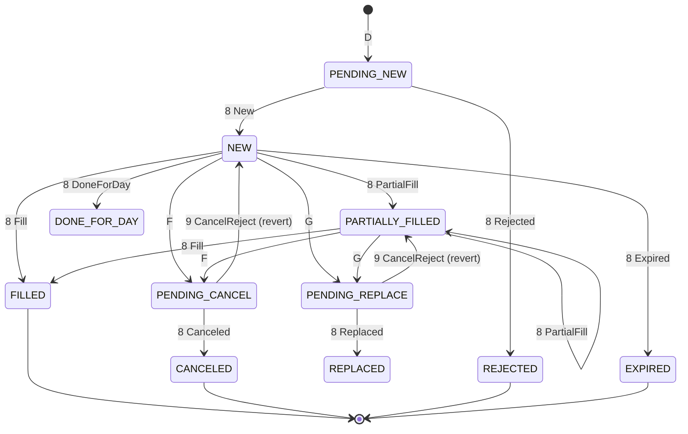

# Public API & Order-State Machine

> **Design draft.** This document is part of the design exploration. For the authoritative, reconciled decisions and the corrections applied after review, see [00-overview.md](00-overview.md).


This document specifies the `com.fix42.oms.api.OmsCache` facade and the
per-message state-update rules that drive `OrderState` for the seven in-scope
FIX 4.2 message types. Every field, index, method, and enum name is taken
verbatim from the project anchor. Where FIX 4.2 semantics are subtle (or a tag
belongs to a later FIX version), it is called out explicitly.

---

## 1. Scope recap

In-scope message types (35=):

| 35= | Name                         | Direction (typical)      | Mutates state? |
|-----|------------------------------|--------------------------|----------------|
| D   | NewOrderSingle               | buy-side -> sell-side    | yes (creates)  |
| 8   | ExecutionReport              | sell-side -> buy-side    | yes (primary)  |
| 9   | OrderCancelReject            | sell-side -> buy-side    | yes (reverts)  |
| F   | OrderCancelRequest           | buy-side -> sell-side    | yes (pending)  |
| G   | OrderCancelReplaceRequest    | buy-side -> sell-side    | yes (pending)  |
| H   | OrderStatusRequest           | buy-side -> sell-side    | no (history)   |
| Q   | DontKnowTrade (DK)           | buy-side -> sell-side    | no (history)   |

The cache is fed an **audit-trail / drop-copy** stream, so both request messages
(D/F/G/H/Q) and the sell-side responses (8/9) are observed. The
`ExecutionReport` (35=8) is the authoritative state driver; requests move the
order into `PENDING_*` states that are confirmed or reverted by a later 8 or 9.

---

## 2. The `OmsCache` facade

```java
package com.fix42.oms.api;

import com.fix42.oms.proto.OrderState;
import com.fix42.oms.proto.Fix.FixMessage;

import java.util.List;
import java.util.Optional;

/**
 * Thread-safe in-memory OMS cache facade.
 *
 * Maintains the latest {@link OrderState} for every order (parent and child)
 * plus the joined message_history per order, and exposes lookup by
 * OrderID / ClOrdID / ExecID and search by Account / Symbol.
 */
public interface OmsCache {

    // ---- Ingestion (auto-dispatch) ----

    /** Parse a raw FIX 4.2 string, dispatch by 35=, apply, return the updated state. */
    OrderState process(String rawFix);

    /** Dispatch an already-parsed generic message by its 35= value. */
    OrderState process(FixMessage message);

    // ---- Ingestion (explicit per-type; message already parsed) ----

    OrderState processNewOrderSingle(FixMessage message);          // 35=D
    OrderState processExecutionReport(FixMessage message);         // 35=8
    OrderState processOrderCancelReject(FixMessage message);       // 35=9
    OrderState processOrderCancelRequest(FixMessage message);      // 35=F
    OrderState processOrderCancelReplaceRequest(FixMessage message);// 35=G
    OrderState processOrderStatusRequest(FixMessage message);      // 35=H
    OrderState processDontKnowTrade(FixMessage message);           // 35=Q

    // ---- Point lookups ----

    Optional<OrderState> getByOrderId(String orderId);
    Optional<OrderState> getByClOrdId(String clOrdId);
    Optional<OrderState> getByExecId(String execId);

    // ---- Searches ----

    List<OrderState> findByAccount(String account);
    List<OrderState> findBySymbol(String symbol);

    // ---- Parent / child ----

    List<OrderState> getChildren(String parentOrderId);
    Optional<OrderState> getParent(String childOrderId);
}
```

### 2.1 Method contracts

| Method | Returns | Null / empty semantics |
|---|---|---|
| `process(String rawFix)` | The `OrderState` after applying the message. | Throws `IllegalArgumentException` on unparseable input or a null/blank string. For 35=H/Q the returned state is the touched order with only `message_history` grown. Throws `UnsupportedMsgTypeException` if 35= is out of scope. |
| `process(FixMessage)` | Same as above. | Same; message must contain tag 35. |
| `processNewOrderSingle` | The freshly created (or re-materialized) `OrderState`. | Never null. |
| `processExecutionReport` | The reconciled/updated `OrderState`. | Never null; may create the state if the 8 is the first message seen for that OrderID (out-of-order / gap recovery). |
| `processOrderCancelReject` | The order whose pending transition was reverted. | If the referenced order is unknown, returns a minimal state recording the reject in history (see §6.4). |
| `processOrderCancelRequest` / `...ReplaceRequest` | The order moved to `PENDING_CANCEL` / `PENDING_REPLACE`. | If `OrigClOrdID` resolves nothing, a pending placeholder is created keyed by the new `ClOrdID` (see §6.2/§6.3). |
| `processOrderStatusRequest` / `processDontKnowTrade` | The attached order (history-only). | If unresolved, a placeholder keyed by the available id is created; no field mutation. |
| `getByOrderId` / `getByClOrdId` / `getByExecId` | `Optional<OrderState>` | Empty `Optional` when not found. `getByClOrdId` resolves through `clOrdIdIndex` (any ClOrdID in the chain) and falls back to `pendingByClOrdId`. Never returns null. |
| `findByAccount` / `findBySymbol` | `List<OrderState>` | Empty (never null) immutable list when nothing matches. Order is unspecified. |
| `getChildren(parentOrderId)` | `List<OrderState>` | Empty list if the order is unknown or has no children. |
| `getParent(childOrderId)` | `Optional<OrderState>` | Empty if the child is unknown or has no parent link. |

### 2.2 Thread-safety guarantees

- All seven indexes (§3) are backed by `ConcurrentHashMap` (Set values use
  `ConcurrentHashMap.newKeySet()`). Reads never block writes.
- **Per-order write serialization.** Mutations for a single logical order (a
  ClOrdID chain / OrderID) are serialized under a per-order lock (a striped lock
  or a lock held on the `OrderState` builder). This guarantees that concurrent
  8's for the same OrderID apply atomically (cum_qty, exec_id dedupe, index
  migration) without lost updates.
- `OrderState` is an **immutable protobuf message**; each mutation builds a new
  instance and atomically swaps it into `primary`. Readers therefore always see
  a consistent snapshot — never a half-updated order.
- Lookups (`getBy*`, `findBy*`, `getChildren`, `getParent`) are lock-free and
  return the currently-published snapshot. They may observe a state that is one
  update behind a concurrent in-flight write; they never observe a torn state.
- Cross-order operations (parent roll-up in §7) acquire the child lock then the
  parent lock in a fixed **orderId-ascending** order to avoid deadlock.

> **Open question:** the anchor's public API is declared as returning
> `OrderState` (not `Optional`) for the `processXxx` methods but `Optional` for
> the getters. We keep those exact return types; the "unresolved" cases above
> create a placeholder rather than returning null so the process-methods never
> break their non-null contract.

---

## 3. Indexes touched by the state machine

All concurrent, all in `:oms-cache`. Names are canonical.

| Index | Type | Populated by |
|---|---|---|
| `primary` | `orderId -> OrderState` | first 8 that assigns OrderID; every subsequent update |
| `pendingByClOrdId` | `clOrdId -> OrderState` | D (and F/G/H/Q when no OrderID yet); **removed** on OrderID assignment |
| `clOrdIdIndex` | `clOrdId -> orderId` | every ClOrdID in the chain (D current, F/G new ClOrdID, replaced ClOrdID) |
| `execIdIndex` | `execId -> orderId` | each 8 (and Q's ExecID reference) |
| `accountIndex` | `account -> Set<orderId>` | on OrderID assignment |
| `symbolIndex` | `symbol -> Set<orderId>` | on OrderID assignment |
| `parentIndex` | `parentOrderId -> Set<childOrderId>` | when `ParentLinkResolver` yields a parent (§7) |

**Index migration rule (the linchpin).** Before the first 8, an order lives only
in `pendingByClOrdId` (keyed by ClOrdID) because no OrderID exists. The first 8
carrying tag 37 performs the migration atomically:

```
resolve state (by ClOrdID / OrigClOrdID from pendingByClOrdId)
state.order_id = OrderID(37)
primary.put(orderId, state)
pendingByClOrdId.remove(state.cl_ord_id)     // no longer pending
clOrdIdIndex.put(state.cl_ord_id, orderId)   // and every prior ClOrdID in chain
accountIndex.get(account).add(orderId)
symbolIndex.get(symbol).add(orderId)
```

---

## 4. `OrderState` fields updated by the state machine

Canonical snake_case proto fields, grouped by who writes them:

| Group | Fields | Written by |
|---|---|---|
| Identity | `order_id`(37), `cl_ord_id`(11 current), `orig_cl_ord_id`(41 latest) | D, 8, F, G |
| Static order params | `account`(1), `symbol`(55), `side`(54), `ord_type`(40), `order_qty`(38), `price`(44), `stop_px`(99), `time_in_force`(59), `currency`(15) | D; re-stated by confirmed G |
| Execution state | `ord_status`(39), `last_exec_type`(150), `cum_qty`(14), `leaves_qty`(151), `avg_px`(6), `last_qty`(32), `last_px`(31), `last_market`(30) | 8 |
| Reject / text | `text`(58), `ord_rej_reason`(103), `cxl_rej_reason`(102) | 8 (103), 9 (102/58) |
| Linking | `parent_order_id`, `child_order_ids`, `is_parent` | ParentLinkResolver (§7) |
| Bookkeeping | `first_seen_epoch_millis`, `last_update_epoch_millis`, `last_msg_type` | every message |
| Histories | `cl_ord_id_history`, `exec_ids`, `message_history` | D/F/G (ClOrdIDs), 8/Q (ExecIDs), all (message_history) |

Every processed message appends its parsed generic `FixMessage` to
`message_history` (arrival order) and updates `last_update_epoch_millis` +
`last_msg_type`.

---

## 5. The order-state machine (`OrdStatus` transitions)

`OrdStatus` (tag 39) is the primary lifecycle field. Enum numeric values are
semantic (not the FIX char codes); the char codes below are the FIX 4.2 wire
values that the codec maps to the enum.

### 5.1 FIX 4.2 `OrdStatus` (39) wire codes

| Code | OrdStatus | Terminal? |
|---|---|---|
| 0 | NEW | no |
| 1 | PARTIALLY_FILLED | no |
| 2 | FILLED | yes |
| 3 | DONE_FOR_DAY | yes (session) |
| 4 | CANCELED | yes |
| 5 | REPLACED | transitions to new order |
| 6 | PENDING_CANCEL | no (in-flight) |
| 7 | STOPPED | yes |
| 8 | REJECTED | yes |
| 9 | SUSPENDED | no |
| A | PENDING_NEW | no (in-flight) |
| B | CALCULATED | no |
| C | EXPIRED | yes |
| E | PENDING_REPLACE | no (in-flight) |

> Note: FIX 4.2 does **not** define `OrdStatus` values `D` (Accepted for
> bidding) or `F` (Trade). Those arrived later. We only emit the codes above.

### 5.2 Transition table

Rows = current `ord_status`; the cell = the message/`ExecType` that legally moves
it, and the resulting status.

| From \ Event | 8 ExecType=NEW | 8 PARTIAL_FILL | 8 FILL | F (req) | 8 PENDING_CANCEL | 8 CANCELED | G (req) | 8 PENDING_REPLACE | 8 REPLACED | 9 CxlReject | 8 REJECTED / EXPIRED / DFD |
|---|---|---|---|---|---|---|---|---|---|---|---|
| PENDING_NEW | NEW | PARTIALLY_FILLED | FILLED | PENDING_CANCEL | PENDING_CANCEL | CANCELED | PENDING_REPLACE | PENDING_REPLACE | REPLACED | revert->prior | REJECTED / EXPIRED / DONE_FOR_DAY |
| NEW | (NEW) | PARTIALLY_FILLED | FILLED | PENDING_CANCEL | PENDING_CANCEL | CANCELED | PENDING_REPLACE | PENDING_REPLACE | REPLACED | — | EXPIRED / DONE_FOR_DAY |
| PARTIALLY_FILLED | — | PARTIALLY_FILLED | FILLED | PENDING_CANCEL | PENDING_CANCEL | CANCELED | PENDING_REPLACE | PENDING_REPLACE | REPLACED | — | EXPIRED / DONE_FOR_DAY |
| PENDING_CANCEL | — | PARTIALLY_FILLED* | FILLED* | — | (PENDING_CANCEL) | CANCELED | — | — | — | revert->prior | — |
| PENDING_REPLACE | — | PARTIALLY_FILLED* | FILLED* | — | — | — | — | (PENDING_REPLACE) | REPLACED | revert->prior | — |
| FILLED | — | — | — | — | — | — | — | — | — | — | — (terminal) |
| CANCELED / REJECTED / EXPIRED | — | — | — | — | — | — | — | — | — | — | — (terminal) |

`*` A fill may still arrive while a cancel/replace is pending (a race the venue
resolves); we apply the fill quantities but keep the pending status until the
confirming/rejecting message resolves it. `(X)` = idempotent re-statement of the
same status (e.g. duplicate NEW). `revert->prior` = a 9 restores the
pre-pending status snapshot (§6.4).



---

## 6. Per-message update rules

### 6.1 `D` NewOrderSingle (35=D)

**Purpose:** originates a new order; no OrderID (37) yet.

**Chain resolution:** none — this is the chain root. Key by `ClOrdID`(11).

**Fields set:**

```
first_seen_epoch_millis = now; last_update_epoch_millis = now
last_msg_type = "D"
cl_ord_id       = 11
account         = 1
symbol          = 55
side            = 54  (mapped to Side enum)
ord_type        = 40  (mapped to OrdType enum)
order_qty       = 38
price           = 44        (present for OrdType=Limit)
stop_px         = 99        (present for OrdType=Stop/StopLimit)
time_in_force   = 59  (mapped to TimeInForce enum)
currency        = 15
ord_status      = PENDING_NEW      // cache assumption until first 8
last_exec_type  = (unset)
cum_qty = 0; leaves_qty = order_qty; avg_px = 0
cl_ord_id_history += 11
message_history  += <parsed D>
```

**Indexes touched:**

```
pendingByClOrdId.put(clOrdId, state)
clOrdIdIndex.put(clOrdId, /* no orderId yet */ )   // deferred: stored when 8 arrives
```

`accountIndex` / `symbolIndex` are **not** written yet (they key by OrderID,
which is unknown). They are populated on OrderID assignment (§3).

**Edge handling:**
- Duplicate D with the same ClOrdID (audit-trail replay): idempotent — dedupe by
  ClOrdID; still append to `message_history` only if not already present (dedupe
  by a message fingerprint / SeqNum 34).
- `ord_status` starts at `PENDING_NEW`. If the venue's first 8 reports
  `OrdStatus=NEW`, no conflict; if it reports `REJECTED`, §6.5 applies.

> **Open question:** the anchor lists `ord_status` PENDING_NEW *or* NEW for D.
> Because a `D` is a buy-side *request*, the venue has not accepted it yet, so
> the cache uses `PENDING_NEW` on D and only moves to `NEW` on the confirming 8.
> Deployments preferring optimistic `NEW` can override via a policy flag.

---

### 6.2 `8` ExecutionReport (35=8) — the primary driver

**Purpose:** authoritative execution/status update from the sell-side.

**Chain resolution (in order):**

1. If `OrderID`(37) present and known in `primary` -> that state.
2. Else if `OrderID`(37) present but unknown, and `ClOrdID`(11) or
   `OrigClOrdID`(41) resolves via `pendingByClOrdId` / `clOrdIdIndex` -> that
   state, then **assign** `order_id` and migrate indexes (§3).
3. Else if only `ClOrdID`/`OrigClOrdID` known -> resolve via `pendingByClOrdId`.
4. Else (nothing resolves) -> create a fresh state keyed by OrderID (gap /
   out-of-order recovery), best-effort populate static params from the 8.

**Fields set from the report:**

```
last_msg_type   = "8"; last_update_epoch_millis = now
order_id        = 37                 (assign + migrate indexes if new)
cl_ord_id       = 11  (if present, becomes current)
orig_cl_ord_id  = 41  (if present)
ord_status      = 39  (mapped OrdStatus)      -> drives transition (§5)
last_exec_type  = 150 (mapped ExecType)
cum_qty         = 14
leaves_qty      = 151
avg_px          = 6
last_qty        = 32  (this fill's qty)
last_px         = 31  (this fill's price)
last_market     = 30  (LastMkt, if present)
ord_rej_reason  = 103 (only when ExecType/OrdStatus = REJECTED)
text            = 58  (if present)
```

**ExecID handling (dedupe):**

```
execId = 17
if execId not in exec_ids:
    exec_ids += execId
    execIdIndex.put(execId, order_id)
// duplicate ExecID => drop the qty effect (idempotent replay guard)
```

Because `cum_qty`/`leaves_qty`/`avg_px` are **absolute snapshots** in the 8
(not deltas), a de-duplicated duplicate report is safely ignored for quantities;
`last_qty`/`last_px` reflect only genuinely new fills.

**Per-`ExecType`(150) behavior** (FIX 4.2 codes):

| ExecType (150) | Code | Effect |
|---|---|---|
| NEW | 0 | PENDING_NEW -> NEW; confirm acceptance; set OrderID; migrate indexes. |
| PARTIAL_FILL | 1 | apply fill (cum_qty/leaves_qty/avg_px/last_qty/last_px); status PARTIALLY_FILLED. |
| FILL | 2 | final fill; leaves_qty=0; status FILLED (terminal). |
| DONE_FOR_DAY | 3 | status DONE_FOR_DAY; session-terminal, no more fills today. |
| CANCELED | 4 | resolves PENDING_CANCEL -> CANCELED (terminal). |
| REPLACED | 5 | resolves PENDING_REPLACE: apply staged params, new ClOrdID becomes `cl_ord_id`; status REPLACED then effectively the new working order. |
| PENDING_CANCEL | 6 | status PENDING_CANCEL (echo of F acceptance). |
| STOPPED | 7 | status STOPPED. |
| REJECTED | 8 | status REJECTED; set `ord_rej_reason`(103), `text`(58). |
| SUSPENDED | 9 | status SUSPENDED. |
| PENDING_NEW | A | status PENDING_NEW (echo). |
| CALCULATED | B | status CALCULATED; avg_px recomputed by venue. |
| EXPIRED | C | status EXPIRED (terminal). |
| RESTATED | D | unsolicited restatement (e.g. GT renewal, corporate action); re-apply snapshot fields **without** advancing status; `ExecRestatementReason`(378) captured into `text` if present. |

> Note on trade cancel/correct: FIX 4.2 uses `ExecTransType`(20) with
> `ExecRefID`(19) rather than ExecType Trade-Cancel/Correct (those are FIX 4.3+).
> When `ExecTransType`(20) = 1 (Cancel) or 2 (Correct), the referenced ExecID
> (19) is looked up in `execIdIndex`; the prior fill's contribution is backed
> out (cancel) or replaced (correct) and `cum_qty`/`avg_px` recomputed from the
> surviving `exec_ids`. `ExecTransType` maps to the `ExecTransType` enum.

**Indexes touched:** `primary` (put/update), `pendingByClOrdId` (remove on
assignment), `clOrdIdIndex` (put current + any new ClOrdID), `execIdIndex` (put),
`accountIndex`/`symbolIndex` (add orderId on first assignment), `parentIndex`
(via roll-up, §7).

**Edge handling:**
- Out-of-order 8 before D: create state from the 8 (case 4), later D is merged by
  ClOrdID (dedupe of static params).
- 8 with `OrdStatus=REPLACED` but no staged G (missed request in stream): apply
  the report's own params directly and log an inconsistency; new ClOrdID from 11.
- Fill arriving during PENDING_CANCEL/PENDING_REPLACE: apply quantities, keep
  the pending status (see §5.2 `*`).

---

### 6.3 `F` OrderCancelRequest (35=F)

**Purpose:** buy-side asks to cancel the remaining quantity of an order.

**Chain resolution:** by `OrigClOrdID`(41) -> the ClOrdID being canceled. Look
up `clOrdIdIndex[OrigClOrdID] -> orderId -> primary`, else `pendingByClOrdId`.

**Fields set:**

```
last_msg_type   = "F"; last_update_epoch_millis = now
orig_cl_ord_id  = 41            // the target
cl_ord_id       = 11            // NEW ClOrdID for THIS cancel request; becomes current
prior_status    = <snapshot ord_status>   // stashed for possible 9 revert (§6.4)
ord_status      = PENDING_CANCEL
cl_ord_id_history += 11
message_history += <parsed F>
```

**Indexes touched:** `clOrdIdIndex.put(newClOrdId, orderId)`;
`pendingByClOrdId` updated if still pre-OrderID.

**Edge handling:**
- No quantity/price fields change — a cancel does not alter order params.
- If `OrigClOrdID` resolves nothing, create a pending placeholder keyed by the
  new ClOrdID; reconcile when the confirming 8/9 arrives.
- The confirming 8 with `ExecType=CANCELED` (§6.2) moves to terminal CANCELED;
  a 9 reverts (§6.4).

---

### 6.4 `G` OrderCancelReplaceRequest (35=G)

**Purpose:** buy-side amends an order (qty/price/TIF/etc.). Params are **staged**
and only applied when the confirming 8 (`ExecType=REPLACED`) arrives.

**Chain resolution:** by `OrigClOrdID`(41), same as F.

**Fields set (immediately):**

```
last_msg_type   = "G"; last_update_epoch_millis = now
orig_cl_ord_id  = 41
cl_ord_id       = 11            // new ClOrdID; becomes current on confirmation
prior_status    = <snapshot ord_status>
ord_status      = PENDING_REPLACE
cl_ord_id_history += 11
message_history += <parsed G>
```

**Staged (pending) params — held aside, NOT yet written to the live fields:**

```
staged.order_qty     = 38   (new)
staged.price         = 44   (new)
staged.stop_px       = 99   (new)
staged.time_in_force = 59   (new)
staged.ord_type      = 40   (if changed)
```

On the confirming `8 ExecType=REPLACED`:

```
apply staged.* -> order_qty / price / stop_px / time_in_force / ord_type
cl_ord_id = new ClOrdID   (already current)
ord_status = REPLACED, then the working order continues under new ClOrdID
leaves_qty recomputed from new order_qty - cum_qty
```

**Indexes touched:** `clOrdIdIndex.put(newClOrdId, orderId)`.

**Edge handling:**
- If a fill occurs before the replace confirms, `cum_qty` advances; on REPLACED,
  `leaves_qty = new order_qty - cum_qty` (may be negative if the new qty is below
  already-filled qty — venue typically rejects; if so a 9 reverts).
- A 9 (CancelReject, CxlRejResponseTo=2) reverts to `prior_status` and discards
  staged params (§6.5).

---

### 6.5 `9` OrderCancelReject (35=9)

**Purpose:** the venue rejects a pending F or G; the order stays as it was.

**Chain resolution:** by `ClOrdID`(11) / `OrigClOrdID`(41) on the 9 -> the order
whose F/G is being rejected.

**Key tag — `CxlRejResponseTo`(434):**

| 434 value | Rejecting | Revert to |
|---|---|---|
| 1 | OrderCancelRequest (F) | the stashed `prior_status` before PENDING_CANCEL |
| 2 | OrderCancelReplaceRequest (G) | the stashed `prior_status` before PENDING_REPLACE; discard staged params |

**Fields set:**

```
last_msg_type  = "9"; last_update_epoch_millis = now
ord_status     = prior_status        // revert PENDING_CANCEL/PENDING_REPLACE
cxl_rej_reason = 102                  // CxlRejReason
text           = 58
message_history += <parsed 9>
```

`CxlRejReason`(102) maps to the `CxlRejResponseTo`/reason handling; note tag 102
is the reason, tag 434 is the *response-to* discriminator. Also present:
`OrdStatus`(39) on the 9 itself echoes the venue's view of current status and, if
present, is preferred over the local `prior_status` snapshot.

**Edge handling:**
- If the order is unknown (reject for an F/G we never saw), return a minimal
  placeholder state recording the 9 in `message_history` and set
  `cxl_rej_reason`/`text`; do not fabricate an order lifecycle.
- `CxlRejReason=1` ("Unknown order") is common in audit streams for stale
  requests — logged, no revert needed if no local pending state exists.

---

### 6.6 `H` OrderStatusRequest (35=H)

**Purpose:** buy-side polls the venue for an order's current status. **No state
mutation.**

**Chain resolution:** by `OrderID`(37) if present, else `ClOrdID`(11); attach to
the resolved chain.

**Effect:**

```
last_msg_type = "H"; last_update_epoch_millis = now
message_history += <parsed H>
// no ord_status / qty / price changes
```

**Indexes touched:** none (the order already exists). If unresolved, a
history-only placeholder keyed by the available id is created.

**Edge handling:** the venue's answer arrives as an 8 (§6.2) and drives any real
change; the H itself is purely an audit record.

---

### 6.7 `Q` DontKnowTrade / DK (35=Q)

**Purpose:** the receiving party (typically buy-side) rejects/does-not-recognize
a trade reported by the venue. Used for reconciliation; **typically no
fill-state change** in the cache.

**Chain resolution:** by `OrderID`(37) and/or `ExecID`(17 -> resolved via
`execIdIndex`). Link to the order the DK'd execution belongs to.

**Fields / record:**

```
last_msg_type = "Q"; last_update_epoch_millis = now
DKReason (127) -> captured (into text or a dedicated note)
message_history += <parsed Q>
// no cum_qty / avg_px change: the DK disputes but does not itself unwind a fill
```

**Reconciliation use:** a DK flags a mismatch between the two parties' books. The
cache records it against the order/exec so downstream reconciliation can pair the
disputed `ExecID` with the DK. An actual unwind, if the venue agrees, arrives
later as an 8 with `ExecTransType`(20)=1 (Cancel) referencing the ExecID (§6.2),
which *does* back out the quantity.

**Edge handling:** if neither OrderID nor a known ExecID resolves, store a
history-only placeholder keyed by whatever id is present; surface for manual
reconciliation.

---

## 7. Parent / child linking

### 7.1 `ParentLinkResolver`

FIX 4.2 has **no standard parent-order tag**. The default resolver reads a
configurable tag; the anchor's default is **tag 526 `SecondaryClOrdID`**.

```java
package com.fix42.oms.link;

import com.fix42.oms.proto.Fix.FixMessage;
import java.util.Optional;

/** Resolves the parent-order key for a child message. Pluggable per deployment. */
public interface ParentLinkResolver {
    /** @return the parent link value (e.g. a parent ClOrdID/OrderID), or empty. */
    Optional<String> resolveParentKey(FixMessage message);
}

/** Default: read a configurable tag (default 526 SecondaryClOrdID). */
public final class TagBasedParentLinkResolver implements ParentLinkResolver {
    private final int tag; // default 526
    public TagBasedParentLinkResolver(int tag) { this.tag = tag; }
    public TagBasedParentLinkResolver() { this(526); }

    @Override public Optional<String> resolveParentKey(FixMessage m) {
        return m.getFieldsList().stream()
                .filter(f -> f.getTag() == tag)
                .map(f -> f.getValue())
                .filter(v -> !v.isEmpty())
                .findFirst();
    }
}
```

> **Open question:** tag 526 `SecondaryClOrdID` is a real FIX tag but was
> introduced in FIX 4.3, not 4.2. The anchor fixes it as the *default*
> convention precisely because 4.2 lacks a native parent tag; deployments on
> strict 4.2 dictionaries should override the tag number (e.g. a custom tag in
> the 5000+ user range) via `TagBasedParentLinkResolver(int)`. The name and the
> "default 526" decision are retained per the anchor.

### 7.2 Linking mechanics

When a child message resolves a parent key:

```
parentOrderId = resolve(parentKey)   // via clOrdIdIndex / primary
child.parent_order_id = parentOrderId
parent.child_order_ids += childOrderId    (dedupe)
parent.is_parent = true
parentIndex.get(parentOrderId).add(childOrderId)
```

### 7.3 Roll-up: child updates aggregate to the parent

When a child `OrderState` changes (a fill on an 8), the parent aggregate is
recomputed from the current children set:

| Parent field | Aggregation |
|---|---|
| `cum_qty` | sum of children `cum_qty` |
| `order_qty` | sum of children `order_qty` (or the parent's own if it carries its own qty) |
| `leaves_qty` | sum of children `leaves_qty` |
| `avg_px` | qty-weighted: `sum(child.cum_qty * child.avg_px) / sum(child.cum_qty)` |
| `ord_status` | **represented / worst-of** status (see below) |
| `last_qty` / `last_px` / `last_market` | copied from the child whose fill triggered the roll-up |

**Represented status rule (worst-of / least-complete wins):** the parent shows
the least-progressed meaningful status so a partially-worked basket is never
shown as FILLED prematurely.

```
if any child in {PENDING_NEW, NEW}            -> parent NEW / PARTIALLY_FILLED per fills
if any child PARTIALLY_FILLED                 -> parent PARTIALLY_FILLED
if all children FILLED                        -> parent FILLED
if all children terminal and any CANCELED     -> parent CANCELED (if none filled) else PARTIALLY_FILLED
pending states on a child                     -> parent reflects PENDING_* if it has no other working children
```

Roll-up runs under the fixed child-lock-then-parent-lock ordering (§2.2).
`getChildren(parentOrderId)` reads `parentIndex` then `primary`;
`getParent(childOrderId)` reads `child.parent_order_id` then `primary`.

---

## 8. End-to-end usage examples

### 8.1 New order, partial fill, full fill

```java
OmsCache cache = OmsCacheFactory.inMemory();   // default resolver: tag 526

// 1) 35=D NewOrderSingle: buy 1000 IBM @ 190.00, ClOrdID=ABC1, Account=ACCT7
String d = "8=FIX.4.2|9=...|35=D|34=1|49=BUYSIDE|56=SELLSIDE|11=ABC1|1=ACCT7|"
         + "55=IBM|54=1|38=1000|40=2|44=190.00|59=0|15=USD|10=000|";
OrderState s1 = cache.process(d.replace('|', ''));
// s1.getOrdStatus() == OrdStatus.PENDING_NEW; leaves_qty == 1000; in pendingByClOrdId

// 2) 35=8 ExecType=NEW, OrderID=ORD100 assigned -> migrates indexes
String ack = "8=FIX.4.2|35=8|11=ABC1|37=ORD100|17=E1|150=0|39=0|"
           + "55=IBM|54=1|38=1000|14=0|151=1000|6=0|1=ACCT7|10=000|";
OrderState s2 = cache.process(ack.replace('|', ''));
// s2.getOrderId() == "ORD100"; getOrdStatus() == NEW; now keyed in primary

// 3) 35=8 ExecType=PARTIAL_FILL: 400 @ 189.95
String pf = "8=FIX.4.2|35=8|11=ABC1|37=ORD100|17=E2|150=1|39=1|"
          + "32=400|31=189.95|30=NYSE|14=400|151=600|6=189.95|10=000|";
cache.process(pf.replace('|', ''));

// 4) 35=8 ExecType=FILL: remaining 600 @ 190.05
String fill = "8=FIX.4.2|35=8|11=ABC1|37=ORD100|17=E3|150=2|39=2|"
            + "32=600|31=190.05|14=1000|151=0|6=190.01|10=000|";
OrderState done = cache.process(fill.replace('|', ''));

// ---- Query ----
System.out.println(done.getOrdStatus());   // FILLED
System.out.println(done.getCumQty());      // 1000.0
System.out.println(done.getLeavesQty());   // 0.0
System.out.println(done.getAvgPx());       // 190.01
System.out.println(done.getExecIdsList()); // [E1, E2, E3]

cache.getByOrderId("ORD100");              // Optional[ORD100 state]
cache.getByClOrdId("ABC1");                // resolves via clOrdIdIndex -> same state
cache.getByExecId("E2");                   // via execIdIndex -> same state
cache.findByAccount("ACCT7");              // [ORD100 state]
cache.findBySymbol("IBM");                 // [ORD100 state]
```

### 8.2 Cancel/replace with a reject-and-revert

```java
OmsCache cache = OmsCacheFactory.inMemory();

// Working order already NEW: OrderID=ORD200, ClOrdID=X1, 500 MSFT @ 410.00
cache.process(newOrderSingle("X1", "ACCT9", "MSFT", 500, 410.00));
cache.process(execAckNew("X1", "ORD200"));   // -> NEW

// 35=G replace: raise price to 411.50, new ClOrdID=X2, OrigClOrdID=X1
String g = "8=FIX.4.2|35=G|11=X2|41=X1|37=ORD200|55=MSFT|54=1|"
         + "38=500|40=2|44=411.50|59=0|10=000|";
OrderState pendingRepl = cache.process(g.replace('|', ''));
// pendingRepl.getOrdStatus() == PENDING_REPLACE; price still 410.00 (staged 411.50)

// 35=9 OrderCancelReject: CxlRejResponseTo(434)=2, CxlRejReason(102)=0, Text="too late"
String rej = "8=FIX.4.2|35=9|11=X2|41=X1|37=ORD200|434=2|102=0|"
           + "39=0|58=too late|10=000|";
OrderState reverted = cache.process(rej.replace('|', ''));

// ---- Query ----
System.out.println(reverted.getOrdStatus());     // NEW  (reverted from PENDING_REPLACE)
System.out.println(reverted.getPrice());         // 410.00 (staged 411.50 discarded)
System.out.println(reverted.getCxlRejReason());  // 0
System.out.println(reverted.getText());          // "too late"
System.out.println(cache.getByClOrdId("X2").isPresent()); // true (in clOrdIdIndex)
```

### 8.3 Parent aggregation (optional)

```java
// Parent basket ORDP1; two children carry 526=ORDP1 (default resolver tag)
cache.process(childOrder("C1", "ORDP1", "AAPL", 300));  // 526=ORDP1
cache.process(execAckNew("C1", "ORDC1"));
cache.process(childOrder("C2", "ORDP1", "AAPL", 200));  // 526=ORDP1
cache.process(execAckNew("C2", "ORDC2"));

cache.process(partialFill("C1", "ORDC1", 300, 227.10));  // child 1 fully filled
cache.process(partialFill("C2", "ORDC2", 100, 227.05));  // child 2 half filled

OrderState parent = cache.getParent("ORDC1").orElseThrow();
System.out.println(parent.getIsParent());        // true
System.out.println(parent.getChildOrderIdsList());// [ORDC1, ORDC2]
System.out.println(parent.getCumQty());          // 400.0  (300 + 100)
System.out.println(parent.getOrdStatus());       // PARTIALLY_FILLED (worst-of)
cache.getChildren("ORDP1");                       // [ORDC1 state, ORDC2 state]
```

---

## 9. Correctness notes / FIX 4.2 caveats summary

- `OrdStatus`(39) values `D`/`F` and `ExecType`(150) trade-cancel/correct codes
  are **FIX 4.3+**; in 4.2 use `ExecTransType`(20) + `ExecRefID`(19) for
  cancel/correct. The codec maps 20 to the `ExecTransType` enum.
- Tag **526 `SecondaryClOrdID`** (parent-link default) is FIX 4.3+; it is used
  only as a configurable convention because 4.2 has no native parent tag —
  override per deployment.
- `cum_qty`/`leaves_qty`/`avg_px` in an 8 are **absolute snapshots**, enabling
  idempotent replay once `exec_ids` dedupe drops repeated ExecIDs.
- `PENDING_NEW`/`PENDING_CANCEL`/`PENDING_REPLACE` are cache-side optimistic
  states set by request messages (D/F/G) and confirmed or reverted by the
  authoritative 8/9. The prior-status snapshot enables clean 9-driven reverts.
- All names (fields, indexes, methods, enums, modules) match the project anchor
  exactly; deviations are flagged only inside `> **Open question:**` notes.
